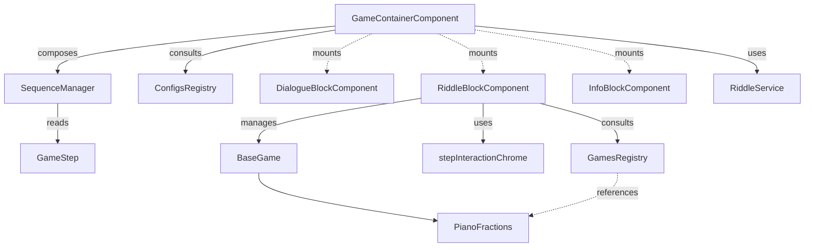

# Frontend Game Engine

The level execution engine of Matheopolis. An autonomous system designed as a State Machine + Iterator.
It reads a JSON scenario and plays UI blocks sequentially (dialogues, riddles, end screens)
until the level is resolved. It is fully agnostic of mini-game rules, so new games can be added without
modifying the engine.

## Fundamental building blocks

### 1. GameContainerComponent (the orchestrator)

- Folder: `src/features/GameEngine/`
- Parent component mounted by the router; frames the whole student run.
- Responsibilities:
  - Session: starts chapter/riddle progression via API services when the user is authenticated,
  - Orchestration: instantiates `SequenceManager` and listens to `stepComplete` events,
  - Dynamic rendering: mounts/unmounts blocks on the fly based on the current step,
  - Closing: completes chapter progression via the API and asks the router to redirect.

Reference signature:

```ts
class GameContainerComponent extends BaseComponent {
  private brain: SequenceManager;
  private riddleId: string;
  private router: Router;
  private chapterId: number;
  constructor(container: HTMLElement, router: Router);
  init(riddleId: string): void;
  private loadCurrentStep(): void;
  private endGame(): void;
}
```

### 2. SequenceManager (the iterator / brain)

- Folder: `src/features/GameEngine/core/`
- Drives scenario progression safely and "blindly".
- Encapsulates the step array (`GameStep[]`) and current index. `advanceToNextStep()` increments the index
  and returns a boolean (`true` if steps remain, `false` if finished), so the container never manipulates arrays directly.

Reference signature:

```ts
class SequenceManager {
  private steps: GameStep[];
  private currentIndex: number;
  constructor(steps: GameStep[]);
  getCurrentStep(): GameStep;
  advanceToNextStep(): boolean;
  private hasNextStep(): boolean;
}
```

### 3. Models & registries (`configs/` and `games/`)

- Registries enforce the Open/Closed Principle; the engine never imports a game directly.
  - `ConfigsRegistry` (`configs/index.ts`): maps a level ID (e.g. `"piano"`) to a `GameStep[]` scenario.
  - `GamesRegistry` (`games/index.ts`): maps a mini-game ID to its TypeScript class.
- Interfaces (`GameStep` and friends) provide strict typing for what each block expects.
  See the canonical data contracts in `docs/frontend-technical-spec.md` (Game step contracts).

### 4. UI blocks (`blocks/`)

Transition components, all extending `BaseComponent`:

- `DialogueBlockComponent`: renders the story line by line.
- `InfoBlockComponent`: static screens (title, victory).
- `RiddleBlockComponent`: the UI shell of a riddle. It owns the shared riddle layout:
  - **Mode banner** at the top (`Tutoriel` / turquoise in practice, `Epreuve` / gold in challenge),
  - title and progress counters (challenge only; replaced by a practice indicator panel in tutoriel mode),
  - scenario `instruction`, optional `introText`, and current question on the left,
  - interactive mini-game host and shared action bar on the right.
  A `practice` step reuses the same shell and mini-game with scoring disabled via `QuestionSequence`.
  `TutorialBlockComponent` was removed; training is always a `RiddleStep` with `mode: "practice"`.

### 4b. Shared step chrome (`blocks/shared/stepInteractionChrome.ts`)

- Renders the completion banner and the action bar: `Indice`, `Valider`, `Suivant`.
- Used by `RiddleBlockComponent`.
- On completion: shows `completionMessage`, hides `Indice` and `Valider`, shows `Suivant` only.
- Mini-games must not auto-advance; the player clicks `Suivant`, which calls `BaseGame.proceedToNextStep()`.

### 5. Mini-game logic (`games/`)

- Where the math rules and per-riddle interactions live (e.g. `PianoFractions`).
- Mini-games render only their interactive surface; title, instruction, score, mistakes, mode banner, and
  step action buttons belong to `RiddleBlockComponent`.
- Mini-games should read question content from the runtime params assembled by `RiddleBlockComponent`.
  Scenario authors put questions in `RiddleStep.questions`; optional `RiddleStep.gameParams` only carries
  per-game options.
- `QuestionSequence` (`games/shared/QuestionSequence.ts`) centralises multi-question progression, score, and
  mistake tracking. Pass `scoring: false` and `trackMistakes: false` when the runtime params mode is `practice`
  (handled via `BaseGame.isPracticeMode()` in games that use the helper).
- Riddle questions carry their own difficulty. `GameContainerComponent` filters questions by
  the current question difficulty before starting the `SequenceManager`; for now, this is difficulty 1.
- `BaseGame` contract: every mini-game must extend the abstract class and implement:
  - `start()`: boot the internal loop,
  - `destroy()`: clean up memory/event listeners (mandatory),
  - `showHint()`: react to hint requests without breaking logic.
- Optional shell integration:
  - `submitAnswer()`: called when the shell `Valider` button is clicked,
  - `markCompleted(score, answer)`: emits `gameCompleted` with `params.completionMessage`; stores pending win,
  - `proceedToNextStep()`: emits `gameWon` when the player clicks `Suivant`.
- Custom events emitted upward: `gameProgress`, `gameValidate`, `gameCompleted`, `gameWon`.

Reference signature:

```ts
abstract class BaseGame {
  protected container: HTMLElement;
  constructor(container: HTMLElement, params: BaseGameParams, context: BaseGameContext);
  start(): void;
  destroy(): void;
  abstract showHint(): void;
  submitAnswer(): void;
  proceedToNextStep(): void;
  protected isPracticeMode(): boolean;
  protected markCompleted(score: number, answer: string): void;
}
```

## Engine relationships



## Execution flow

1. The router mounts `GameContainerComponent` with a level ID (e.g. `"piano"`).
2. The container queries `ConfigsRegistry` for the full scenario.
3. It starts chapter progression via the API when authenticated, then instantiates `SequenceManager`.
4. Event loop: the container reads the current step, checks its type, and mounts the matching block.
5. When the player finishes a block, the block emits `stepComplete`; the container destroys the block and
   calls `advanceToNextStep()`. For riddles, completion requires clicking `Suivant` after the completion banner.
6. For a `riddle` step, the container delegates to `RiddleBlockComponent`, which queries `GamesRegistry`
   to instantiate the pure game class (e.g. `PianoFractions`) and passes `mode`, `instruction`, and
   `completionMessage` through `gameParams`.
7. Practice riddle steps skip score aggregation and `submitAttempt`; challenge steps record both.
8. Challenge riddle steps submit answers per question via `RiddleService`; the container completes the chapter when done.

## Progression

- Authenticated users: chapter and riddle state live in MySQL (`chapter_progressions`, `riddle_progressions`).
- Practice riddle steps do not call progression endpoints.
- Guests: no server-side progression; scenario may still be loaded from `GET /api/chapters/{id}`.
- The backend validates challenge answers via `POST /api/riddles/{id}/responses`.

## Event-driven communication

- Blocks and mini-games communicate upward via custom events (e.g. `stepComplete`, `gameWon`).
- Children broadcast; the parent (`GameContainerComponent` or `RiddleBlockComponent`) listens.
- A child never calls its parent directly, keeping blocks reusable and decoupled.

## Development rules

1. Orchestrator isolation: never add `if/else` targeting a specific mini-game or level ID inside `GameContainerComponent`.
2. New mini-game: create the class in `games/` extending `BaseGame`, add its JSON config in `configs/`, then
   register both in their respective `index.ts` registries. The rest of the app adapts automatically.
3. Hint responsibility: the `Indice` button UI belongs to `stepInteractionChrome` / `RiddleBlockComponent`;
   the visual action belongs to the mini-game class via the mandatory `showHint()`. The hint button is hidden
   once the step is completed and `Suivant` is shown.
4. Memory cleanup: mini-games often use complex listeners (keyboard, drag & drop). `BaseGame.destroy()` must
   remove them to avoid memory leaks when moving to the next step.
