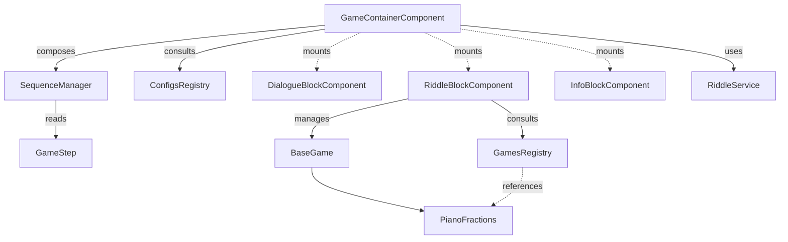

# Frontend Game Engine

The level execution engine of Matheopolis. An autonomous system designed as a State Machine + Iterator.
It reads a JSON scenario and plays UI blocks sequentially (dialogues, riddles, end screens)
until the level is resolved. It is fully agnostic of mini-game rules, so new games can be added without
modifying the engine.

## Fundamental building blocks

### 1. GameContainerComponent (the orchestrator)

- Folder: `src/features/GameEngine/`
- Parent component mounted by the router; frames the whole student run.
- Responsibilities:
  - Security/session: stores `sessionId` and `antiCheatToken` provided by the API at start,
  - Orchestration: instantiates `SequenceManager` and listens to `stepComplete` events,
  - Dynamic rendering: mounts/unmounts blocks on the fly based on the current step,
  - Closing: validates the final score with the API using the anti-cheat token and asks the router to redirect.

Reference signature:

```ts
class GameContainerComponent extends BaseComponent {
  private brain: SequenceManager;
  private riddleId: string;
  private router: Router;
  private sessionId: number;
  private antiCheatToken: string;
  constructor(container: HTMLElement, router: Router);
  init(riddleId: string): void;
  private loadCurrentStep(): void;
  private endGame(): void;
}
```

### 2. SequenceManager (the iterator / brain)

- Folder: `src/features/GameEngine/core/`
- Drives scenario progression safely and "blindly".
- Encapsulates the step array (`GameStep[]`) and current index. `advanceToNextStep()` increments the index
  and returns a boolean (`true` if steps remain, `false` if finished), so the container never manipulates arrays directly.

Reference signature:

```ts
class SequenceManager {
  private steps: GameStep[];
  private currentIndex: number;
  constructor(steps: GameStep[]);
  getCurrentStep(): GameStep;
  advanceToNextStep(): boolean;
  private hasNextStep(): boolean;
}
```

### 3. Models & registries (`configs/` and `games/`)

- Registries enforce the Open/Closed Principle; the engine never imports a game directly.
  - `ConfigsRegistry` (`configs/index.ts`): maps a level ID (e.g. `"piano"`) to a `GameStep[]` scenario.
  - `GamesRegistry` (`games/index.ts`): maps a mini-game ID to its TypeScript class.
- Interfaces (`GameStep` and friends) provide strict typing for what each block expects.
  See the canonical data contracts in `docs/frontend-technical-spec.md` (Game step contracts).

### 4. UI blocks (`blocks/`)

Transition components, all extending `BaseComponent`:

- `DialogueBlockComponent`: renders the story line by line.
- `InfoBlockComponent`: static screens (title, victory).
- `RiddleBlockComponent`: the UI shell of a riddle. It owns the shared riddle layout: title and progress
  counters at the top (hidden in `practice` mode), scenario instruction and questions on the left, and the
  interactive mini-game host on the right. A `practice` step reuses the same shell and mini-game with scoring
  disabled and an optional `introText`.

### 5. Mini-game logic (`games/`)

- Where the math rules and per-riddle interactions live (e.g. `PianoFractions`).
- Mini-games render only their interactive surface; title, instruction, score, and mistakes belong to
  `RiddleBlockComponent`.
- Mini-games should read question content from `RiddleStep.gameParams.questions` instead of hard-coding
  question/answer/hint data in the game class.
- `QuestionSequence` centralises question progression; pass `scoring: false` and `trackMistakes: false`
  when `GameParams.mode` is `practice`.
- Riddle questions carry their own difficulty. `GameContainerComponent` filters questions by
  the current question difficulty before starting the `SequenceManager`; for now, this is difficulty 1.
- `BaseGame` contract: every mini-game must extend the abstract class and implement:
  - `start()`: boot the internal loop,
  - `destroy()`: clean up memory/event listeners (mandatory),
  - `showHint()`: react to hint requests without breaking logic.

Reference signature:

```ts
abstract class BaseGame {
  protected container: HTMLElement;
  constructor(container: HTMLElement, params: GameParams, context: BaseGameContext);
  start(): void;
  destroy(): void;
  abstract showHint(): void;
}
```

## Engine relationships



## Execution flow

1. The router mounts `GameContainerComponent` with a level ID (e.g. `"piano"`).
2. The container queries `ConfigsRegistry` for the full scenario.
3. It validates game start via the API (anti-cheat token) and instantiates `SequenceManager`.
4. Event loop: the container reads the current step, checks its type, and mounts the matching block.
5. When the player finishes a block, the block emits a signal; the container destroys the block and calls `advanceToNextStep()`.
6. For a `riddle` step, the container delegates to `RiddleBlockComponent`, which queries `GamesRegistry`
   to instantiate the pure game class (e.g. `PianoFractions`).
7. At the end of the scenario, the container submits the score (with anti-cheat token) and asks for redirection.

## Security & anti-cheat

- Session start: `RiddleService.startRiddle()` returns an `antiCheatToken` (and session context).
- End of game: `GameContainerComponent` must pass the final score AND the `antiCheatToken` to
  `RiddleService.submitScore()` so the backend can validate progress.
- The backend is authoritative for progression and score validation; the client only transports the token.

## Event-driven communication

- Blocks and mini-games communicate upward via custom events (e.g. `stepComplete`, `gameWon`).
- Children broadcast; the parent (`GameContainerComponent` or `RiddleBlockComponent`) listens.
- A child never calls its parent directly, keeping blocks reusable and decoupled.

## Development rules

1. Orchestrator isolation: never add `if/else` targeting a specific mini-game or level ID inside `GameContainerComponent`.
2. New mini-game: create the class in `games/` extending `BaseGame`, add its JSON config in `configs/`, then
   register both in their respective `index.ts` registries. The rest of the app adapts automatically.
3. Hint responsibility: the "Hint" button UI belongs to `RiddleBlockComponent`; the visual action belongs to
   the mini-game class via the mandatory `showHint()`.
4. Memory cleanup: mini-games often use complex listeners (keyboard, drag & drop). `BaseGame.destroy()` must
   remove them to avoid memory leaks when moving to the next step.
