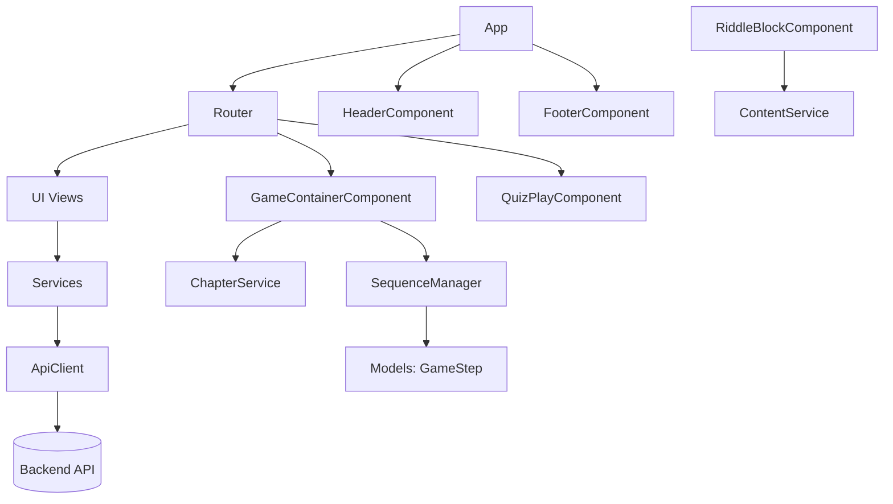

# Frontend Architecture Overview

Bird's-eye view of the Matheopolis Single Page Application (SPA).

The application follows Clean Architecture and strict separation of concerns.
It is divided into five pillars that interact in a secure and predictable way, so that
the classic web interface (dashboards, forms) and the interactive game engine can coexist,
evolve, and communicate without ever becoming entangled.

## The five pillars

### 1. Core & Routing (backbone)

- Key classes: `App`, `Router`, `QuizPlayComponent`.
- `App` is the entrypoint: it initializes the base layout (`Header`, `Footer`) and instantiates the `Router`.
- The `Router` listens to the URL and decides which master view is mounted in the central area.

### 2. Services (data and network)

- Key classes: `ApiClient`, `AuthService`, `QuizService`, `TeacherQuizService`,
  `TeacherContentClassAccessService`, `StudentContentAccessService`, teacher/admin services.
- The only layer allowed to talk to the backend.
- Every business service goes through a single funnel: `ApiClient`.
- This centralizes credentials handling, CSRF propagation, and global network error handling.

### 3. Components: UI & Views

- Key classes: `BaseComponent`, `HomeComponent`, `GameHomeComponent`, `MatheoPanelComponent`, `QuizPlayComponent`, etc.
- Holds all standard screens (home, auth, private dashboard, game menu).
- Every visual element inherits from the abstract `BaseComponent`, sharing the same lifecycle
  (`init`, `render`, scoped CSS isolation).
- Complex components may be split into colocated TypeScript files:
  `Component.ts` for lifecycle/state/events, `Component.template.ts` for HTML builders, and
  `Component.styles.ts` for the scoped CSS string.

### 4. Game Engine: blocks & logic

- Key classes: `GameContainerComponent`, `SequenceManager`, `RiddleBlockComponent`, `BaseGame`.
- An "app within the app": when a student starts a level, this module takes full control.
- It reads a scenario step by step, shows dialogues, runs practice riddle steps, and executes math mini-games.
- The orchestrator (`GameContainerComponent`) is agnostic: it does not know game-specific rules,
  it only loads blocks dynamically. Mini-games (e.g. `PianoFractions`) run autonomously inside their block.

### 5. Models (shared language)

- Key types: `GameStep`, `DialogueStep`, `DialogueLine`, `Quiz`, etc.
- TypeScript data contracts describing the exact shape of data flowing between API, game engine, and views.
- Guarantees strong typing across the whole application.

## Module relationships

## Global lifecycle

1. Unified inheritance: profile page or in-game dialogue box, all derive from `BaseComponent`.
2. Navigation: `App` delegates navigation to the `Router`, which mounts UI views.
3. Game launch: from a view, the `Router` mounts `GameContainerComponent`; context switches from web UI to the game engine.
4. Game loop: the engine uses `SequenceManager` to read `GameStep` contracts and dynamically mounts its own blocks.
5. Persistence: the engine never performs HTTP directly; it calls application services such as `ChapterService`
   and `ContentService`, which call `ApiClient` when backend communication is required.

## Global golden rules

1. Dependency inversion: UI (components or game engine) never talks to the API directly; it calls services.
2. Single responsibility / cascade delegation: the router mounts master views only; each master view
   instantiates, owns, and destroys its own sub-components.
3. Open/closed principle: the game engine is closed to modification but open to extension; adding a new
   mini-game only requires a new `BaseGame` subclass and registry entries, never edits to the orchestrator.

## Mandatory constraints for AI code generation

When generating or modifying frontend code, abide by these constraints:

1. Stack: Vanilla TypeScript + HTML5 + CSS3, pure OOP and DOM manipulation. Never use React, Vue, or Angular syntax.
2. Always extend `BaseComponent` for any UI element, and implement `init()`, `render()`, and `bindEvents()`.
3. Always extend `BaseGame` for any new playable mini-game, and implement `start()`, `destroy()`, `showHint()`.
4. Never call `fetch()`/`axios` inside a component or game; always go through a `Service`, which calls `ApiClient`.
5. Always clean up in `destroy()` (remove listeners, free resources) for games and complex components to avoid memory/DOM leaks.
6. Use scoped CSS: pass the component CSS string as the second argument of `render()`; no global monolithic stylesheet.
   A minimal shell-level responsive guard may live in `App` for page-wide constraints such as preventing
   horizontal document scroll, but component layout rules stay colocated with their owning components.
7. No `any`, especially in service and model layers; use explicit typed interfaces aligned with the OpenAPI contracts.
8. Event-driven messaging: children broadcast via custom events (e.g. `stepComplete`, `gameWon`); parents listen. Never let a child reach into its parent directly.
9. Authentication is PHP session cookie + CSRF (no JWT bearer tokens).

## Detailed references

- Core & routing: `core-routing.md`
- UI components & views: `ui-components.md`
- Services & API layer: `services-api.md`
- Game engine: `game-engine.md`
