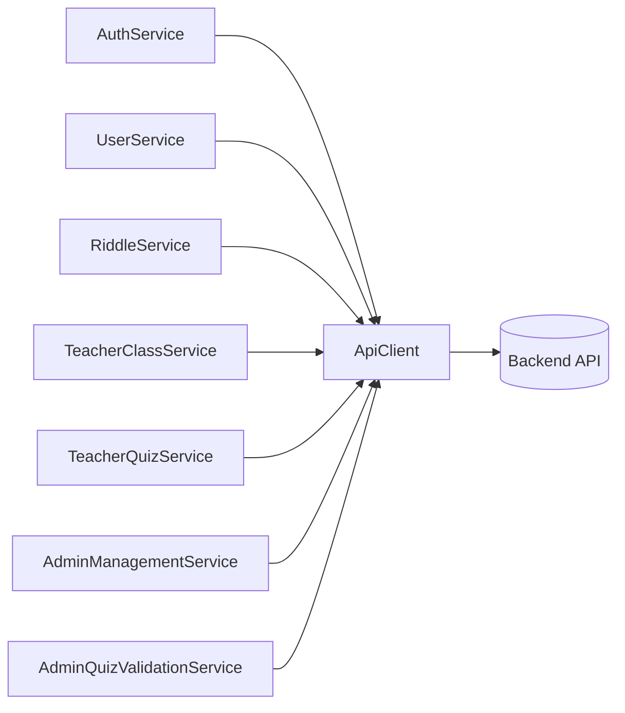

# Frontend Services & API Layer

This module is the exclusive communication interface between the frontend (browser) and the backend (API + database).
It centralizes, secures, and standardizes all network calls.

Principle (dependency inversion): no UI component and no game module talks to the server directly.
They all delegate to services, which rely on a single API client.

## Fundamental building blocks

### 1. ApiClient (the network funnel)

- Folder: `src/services/`
- The technical pillar of communication; a deliberate bottleneck for all outgoing requests.
- Responsibilities:
  - manage the base URL (dev/prod),
  - expose standard HTTP methods (`get`, `post`, `patch`, `delete`).
- Technical note: it is the only file allowed to use native `fetch`/`XMLHttpRequest`.
  It sends the session cookie, propagates the CSRF token header for mutating requests, and intercepts
  global network errors (e.g. forced logout on a `401`).

> Authentication transport: Matheopolis uses **PHP session cookies + CSRF**, not JWT bearer tokens.
> For the game engine, the backend additionally issues short-lived **anti-cheat play tokens** that the
> client must pass back when submitting a score.

Reference signature:

```ts
class ApiClient {
  private baseUrl: string;
  get(endpoint: string, queryParams?: object): Promise<unknown>;
  post(endpoint: string, body?: object): Promise<unknown>;
  patch(endpoint: string, body: object): Promise<unknown>;
  delete(endpoint: string): Promise<unknown>;
}
```

### 2. Core business services (folder root)

- `AuthService`: identity. Login, logout, current session (`getMe`), class-join student registration, and generic account registration.
- `UserService`: user profile retrieval (`getUserProfile`).
- `RiddleService`: bridge to the game engine. Validates level start (`startRiddle`) to obtain anti-cheat
  session tokens, and submits final scores (`submitScore`).

### 3. Teacher subfolder (`services/teacher/`)

Specialized services for teacher-only actions:

- `TeacherClassService`: class CRUD (create/update/delete), student lists, and progression summaries.
- `TeacherQuizService`: lifecycle of teacher-authored quizzes (local CRUD), assignment to classes
  (`listMyQuizzes`), and global validation request (`requestGlobalValidation`) sent to administration.

### 4. Admin subfolder (`services/admin/`)

Isolated moderation and global management capabilities:

- `AdminManagementService`: site user administration, e.g. listing all teachers (`getTeachers`).
- `AdminQuizValidationService`: quiz moderation flow — list pending (`getPendingQuizzes`),
  approve for global publication (`validateQuiz`), or reject with written feedback (`rejectQuiz`).

## Service relationships



## Execution flow example (teacher viewing class stats)

1. View: `ClassManagementComponent` needs table data and calls `TeacherClassService.listStudentsProgress(12)`.
2. Business service: `TeacherClassService` knows the matching server URL and calls `ApiClient.get('/classes/12/progress')`.
3. ApiClient: prepares the request, attaches credentials/CSRF as needed, and sends it.
4. Resolution: the server returns JSON; `ApiClient` parses it and returns it to the service, which returns a
   typed `Promise<StudentProgressSummary[]>` to the component, which updates its UI.

## Development rules

1. ApiClient monopoly: `fetch()`/`axios` are forbidden inside views and business services; every network call
   must go through `ApiClient` methods.
2. Agnostic components: a UI component (e.g. `LoginComponent`) never knows a server endpoint URL nor builds
   complex request objects; it simply calls `AuthService.login(request)` and awaits the response.
3. Strong typing (data contracts): every service method uses strict TypeScript interfaces for inputs
   (e.g. `CreateClassRequest`, `CreateQuizRequest`) and return promises (e.g. `Promise<Class>`, `Promise<Quiz>`).
   `any` is banned from business-service return signatures.
