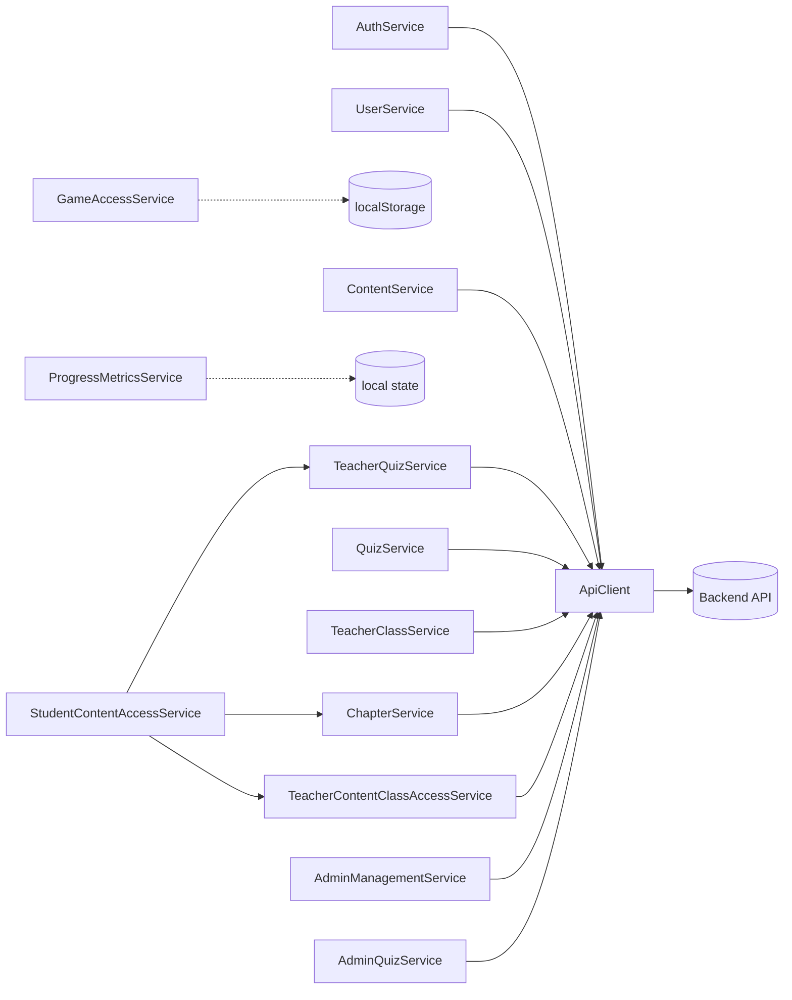

# Frontend Services & API Layer

This module is the exclusive communication interface between the frontend (browser) and the backend (API + database).
It centralizes, secures, and standardizes all network calls.

Principle (dependency inversion): no UI component and no game module talks to the server directly.
They all delegate to services, which rely on a single API client.

## Fundamental building blocks

### 1. ApiClient (the network funnel)

- Folder: `src/services/`
- The technical pillar of communication; a deliberate bottleneck for all outgoing requests.
- Responsibilities:
  - manage the base URL (dev/prod),
  - expose standard HTTP methods (`get`, `post`, `patch`, `put`, `delete`),
  - optional `?mock=1` dev mode with in-memory fixtures for offline UI work.
- Technical note: it is the only file allowed to use native `fetch`/`XMLHttpRequest`.
  It sends the session cookie, propagates the CSRF token header for mutating requests, and intercepts
  global network errors (e.g. forced logout on a `401`).
- CSRF token handling: the client obtains the session-bound CSRF token from the `POST /api/auth/login` and
  `GET /api/auth/me` responses (`data.csrfToken`), stores it, and sends it in the `X-CSRF-Token` header on
  authenticated mutating requests. Public registration/login calls do not require it.

> Authentication transport: Matheopolis uses **PHP session cookies + CSRF**, not JWT bearer tokens.
> Chapter and riddle progression are persisted server-side for authenticated users (`student`, `free_user`,
> `teacher`, `admin`). Guests may call `GET /api/chapters`, `GET /api/chapters/{id}`, and `GET /api/riddles/{id}`
> without a session; they do not persist progression or list quizzes.

Reference signature:

```ts
class ApiClient {
  private baseUrl: string;
  get(endpoint: string, queryParams?: object): Promise<unknown>;
  post(endpoint: string, body?: object): Promise<unknown>;
  patch(endpoint: string, body: object): Promise<unknown>;
  put(endpoint: string, body: object): Promise<unknown>;
  delete(endpoint: string): Promise<unknown>;
}
```

### 2. Core business services (folder root)

- `AuthService`: identity. Login, logout, current session (`getMe`), class-join student registration, and generic account registration.
- `UserService`: user profile retrieval (`getUserProfile`).
- `ChapterService`: narrative chapters (`listChapters`, `getChapter`), chapter progression, chapter step
  synchronization, scenario `stepCount` for progress display, riddle start, and per-question riddle answer
  submission through `/api/riddles/{id}/responses`.
- `QuizService`: quiz consumer flow (shared by all roles that can play a quiz). Lists accessible quizzes
  (`listQuizzes`), fetches a quiz to play without correct answers (`getQuiz`), starts an attempt
  (`startAttempt`), submits a per-question answer (`submitResponse`), reads progression (`getProgress`), and
  fetches the correction of a completed attempt (`getCorrection`, optional `attempt` query param).
- `ContentService`: content-facing service placeholder used by game blocks that need content access.
- `GameAccessService`: local game availability state.
- `ProgressMetricsService`: local progress metrics aggregation.

### 3. Teacher subfolder (`services/teacher/`)

Specialized services for teacher-only actions:

- `TeacherClassService`: class CRUD (create/update/delete), student lists, progression summaries (global average
  across student-accessible chapters and quizzes, plus chapter/quiz detail arrays), CSV export
  (`mode=overview`, `mode=chapter&chapterId=…`, `mode=quiz`, `mode=quiz_public_detail&quizId=…`, or
  `mode=quiz_private_detail&quizId=…`), CSV student import (`nom`/`prenom`), student password reset, and
  owner-teacher/admin student account deletion.
- `TeacherQuizService`: management of teacher-authored quizzes through the backend API. Lists accessible quizzes
  (`listAccessibleQuizzes`), loads management detail (`getQuizDetail`), creates private quizzes (`createQuiz`),
  updates metadata (`updateQuiz`), adds/updates/deletes questions, requests publication (`requestPublication` →
  `askAdmin: true`), cancels publication request (`cancelPublicationRequest` → `askAdmin: false`), and deletes
  quizzes.
- `TeacherContentClassAccessService`: shared teacher service for quiz and chapter target-class overrides. It
  lists cached override rows, resolves effective class access, PUTs non-default overrides, and DELETEs overrides
  for `/api/quizzes/{id}/target-classes/{classId}` and `/api/chapters/{id}/target-classes/{classId}`.
- `StudentContentAccessService`: teacher-facing facade for student content visibility per class. Loads quiz lists
  and chapters from API services, builds the section catalog, and delegates all effective-access resolution and
  PUT/DELETE override calls to `TeacherContentClassAccessService`.

### 4. Admin subfolder (`services/admin/`)

Isolated global management capabilities:

- `AdminManagementService`: site user administration, e.g. listing all teachers (`getTeachers`).
- `AdminQuizService`: quiz administration. Lists quizzes awaiting publication
  (`listPublicationRequests`), publishes (`publishQuiz`), unpublishes (`unpublishQuiz`), dismisses/rejects requests
  (`dismissPublicationRequest` / `rejectPublicationRequest` → clears `askAdmin`), edits questions, updates metadata,
  and deletes quizzes.

## Service relationships



## Execution flow example (teacher granting a private quiz to a class)

1. View: `StudentContentManagementComponent` opens the class-access menu for a private quiz.
2. Facade: `StudentContentAccessService.listClassAccessRows()` delegates override loading and access resolution
   to `TeacherContentClassAccessService`.
3. Toggle ON (grant): `StudentContentAccessService.setClassAccess()` calls
   `TeacherContentClassAccessService.setClassAccess("quiz", quizId, classId, true)`.
4. Toggle back to default (private OFF): `TeacherContentClassAccessService.removeClassAccess()` DELETEs the
   target-class row.
5. ApiClient sends PUT/DELETE with CSRF; UI refreshes cached override rows.

## Development rules

1. ApiClient monopoly: `fetch()`/`axios` are forbidden inside views and business services; every network call
   must go through `ApiClient` methods.
2. Agnostic components: a UI component (e.g. `LoginComponent`) never knows a server endpoint URL nor builds
   complex request objects; it simply calls `AuthService.login(request)` and awaits the response.
3. Strong typing (data contracts): every service method uses strict TypeScript interfaces for inputs
   (e.g. `CreateClassRequest`, `CreateQuizRequest`) and return promises (e.g. `Promise<Class>`, `Promise<Quiz>`).
   `any` is banned from business-service return signatures.
