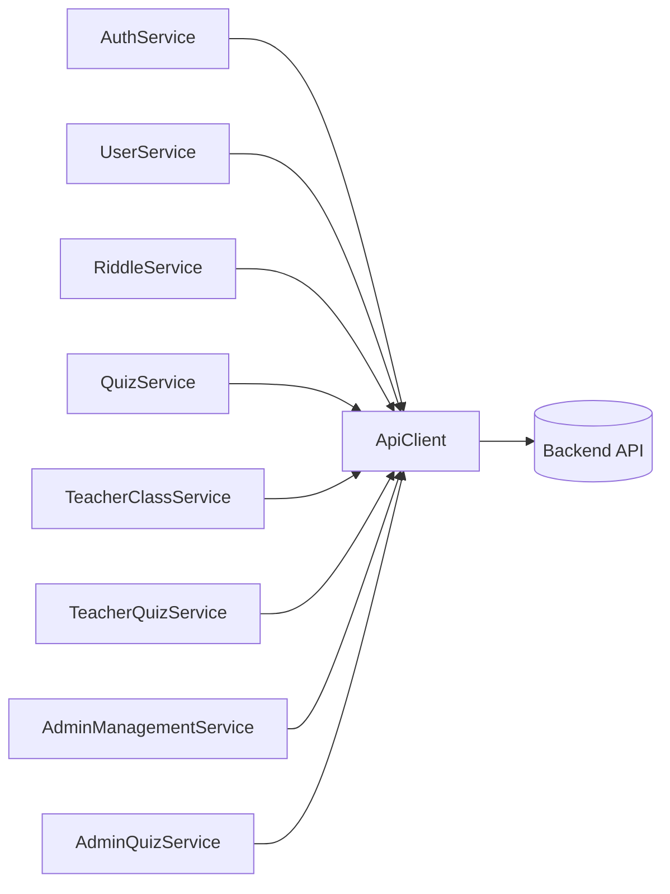

# Frontend Services & API Layer

This module is the exclusive communication interface between the frontend (browser) and the backend (API + database).
It centralizes, secures, and standardizes all network calls.

Principle (dependency inversion): no UI component and no game module talks to the server directly.
They all delegate to services, which rely on a single API client.

## Fundamental building blocks

### 1. ApiClient (the network funnel)

- Folder: `src/services/`
- The technical pillar of communication; a deliberate bottleneck for all outgoing requests.
- Responsibilities:
  - manage the base URL (dev/prod),
  - expose standard HTTP methods (`get`, `post`, `patch`, `put`, `delete`).
- Technical note: it is the only file allowed to use native `fetch`/`XMLHttpRequest`.
  It sends the session cookie, propagates the CSRF token header for mutating requests, and intercepts
  global network errors (e.g. forced logout on a `401`).
- CSRF token handling: the client obtains the session-bound CSRF token from the `POST /api/auth/login` and
  `GET /api/auth/me` responses (`data.csrfToken`), stores it, and sends it in the `X-CSRF-Token` header on
  authenticated mutating requests. Public registration/login calls do not require it.

> Authentication transport: Matheopolis uses **PHP session cookies + CSRF**, not JWT bearer tokens.
> Chapter and riddle progression are persisted server-side for authenticated users (`student`, `free_user`,
> `teacher`, `admin`). Guests may call `GET /api/chapters`, `GET /api/chapters/{id}`, and `GET /api/riddles/{id}`
> without a session; they do not persist progression.

Reference signature:

```ts
class ApiClient {
  private baseUrl: string;
  get(endpoint: string, queryParams?: object): Promise<unknown>;
  post(endpoint: string, body?: object): Promise<unknown>;
  patch(endpoint: string, body: object): Promise<unknown>;
  put(endpoint: string, body: object): Promise<unknown>;
  delete(endpoint: string): Promise<unknown>;
}
```

### 2. Core business services (folder root)

- `AuthService`: identity. Login, logout, current session (`getMe`), class-join student registration, and generic account registration.
- `UserService`: user profile retrieval (`getUserProfile`).
- `ChapterService`: narrative chapters (`listChapters`, `startChapter`, chapter progression).
- `RiddleService`: per-riddle start and per-question responses (`POST /api/riddles/{id}/responses`).
- `QuizService`: quiz consumer flow (shared by all roles that can play a quiz). Lists accessible quizzes
  (`listQuizzes`), fetches a quiz to play without correct answers (`getQuiz`), starts an attempt
  (`startAttempt`), submits a per-question answer (`submitResponse`), reads progression (`getProgress`), and
  fetches the correction of a completed attempt (`getCorrection`). Quizzes are merged into the `GameHome`
  chapter list as chapters of type `quiz`.

### 3. Teacher subfolder (`services/teacher/`)

Specialized services for teacher-only actions:

- `TeacherClassService`: class CRUD (create/update/delete), student lists, and progression summaries.
- `TeacherQuizService`: management of teacher-authored quizzes through the backend API (quizzes are
  database-backed, not local). Creates private quizzes (`createQuiz`), edits questions/options
  (`upsertQuestion`, `deleteQuestion`), manages class access overrides (`setClassAccess` to restrict a public
  quiz for an owned class or grant an owned private quiz to an owned class), and requests publication of an
  owned private quiz (`requestPublication`, which sets the `askAdmin` flag).

### 4. Admin subfolder (`services/admin/`)

Isolated global management capabilities:

- `AdminManagementService`: site user administration, e.g. listing all teachers (`getTeachers`).
- `AdminQuizService`: quiz administration. Lists quizzes awaiting publication
  (`listPublicationRequests`, i.e. quizzes with `askAdmin = true`), publishes a quiz (`publishQuiz`, sets
  `status = public` and clears `askAdmin`), and can create/edit any quiz. There is no rejection workflow or
  stored rejection reason: declining a request simply leaves the quiz `private`.

## Service relationships



## Execution flow example (teacher viewing class stats)

1. View: `ClassManagementComponent` needs table data and calls `TeacherClassService.listStudentsProgress(12)`.
2. Business service: `TeacherClassService` knows the matching server URL and calls `ApiClient.get('/classes/12/progress')`.
3. ApiClient: prepares the request, attaches credentials/CSRF as needed, and sends it.
4. Resolution: the server returns JSON; `ApiClient` parses it and returns it to the service, which returns a
   typed `Promise<StudentProgressSummary[]>` to the component, which updates its UI.

## Development rules

1. ApiClient monopoly: `fetch()`/`axios` are forbidden inside views and business services; every network call
   must go through `ApiClient` methods.
2. Agnostic components: a UI component (e.g. `LoginComponent`) never knows a server endpoint URL nor builds
   complex request objects; it simply calls `AuthService.login(request)` and awaits the response.
3. Strong typing (data contracts): every service method uses strict TypeScript interfaces for inputs
   (e.g. `CreateClassRequest`, `CreateQuizRequest`) and return promises (e.g. `Promise<Class>`, `Promise<Quiz>`).
   `any` is banned from business-service return signatures.
