# Frontend UI Components & Main Views

This module documents all screens (views) the user can interact with: home, authentication,
game menu, quiz player, and the private dashboard (`MatheoPanel`). Unlike the game engine (which runs level logic),
this module handles classic navigation.

Every UI screen is an autonomous component inheriting from a shared base, guaranteeing technical and visual uniformity.

## Fundamental building blocks

### 1. BaseComponent (technical base)

- Folder: `src/components/`
- Abstract founding class dictating mandatory behavior for everything rendered on screen.
- Responsibilities: HTML injection (`render`), scoped CSS isolation (`injectStyle`), mandatory `init()`.

### 2. Shared components

- Folder: `src/components/Shared/`
- `ConfirmationModalComponent` is the reusable shell for two-action or result-style confirmation dialogs.
- Parent views keep domain state and service calls; the modal receives typed display/action config and emits
  confirmation events (`cancel`, `secondary`, `confirm`).
- Its public contracts live in `src/models/components/ConfirmationModal.ts`.
- Form workflows such as create/edit/import modals stay local to their owning view unless a broader modal shell
  is introduced later.

### 3. Public folder (unauthenticated area)

- Folders: `src/components/Public/Home/` and `src/components/Public/Auth/`
- Entry points before login.
- Components:
  - `HomeComponent`: landing/presentation page,
  - `LoginComponent`, `RegisterComponent`, `ResetPasswordComponent`: access forms,
  - `StudentIntroComponent`: optional onboarding before first `GameHome` visit.
- Technical note: auth components accept success callbacks (e.g. `onLoginSuccess`) in their constructor.
  This lets the router decide when to redirect after a successful action, so the view never handles redirection itself.

### 4. GameHome folder (players hub)

- Folder: `src/components/GameHome/`
- Level and quiz selection menu (`GameHomeComponent`).
- Loads narrative chapters and accessible quizzes from services, then renders **three sections in order**:
  1. Chapters (`GET /api/chapters`),
  2. Private questionnaires,
  3. Public questionnaires.
- Provides title search and per-type filter chips (chapters / private quizzes / public quizzes).
- Guests see chapters only; authenticated users also see quizzes they can access.
- Admin users get a card menu (⋮) on each item: edit quiz (opens panel), publish/unpublish, delete quiz/chapter.
- Card click navigates to `/game/:chapterId` or opens `/quiz/:quizId` (with restart/results prompt when completed).

### 5. Quiz player (`features/QuizPlayer/`)

- `QuizPlayComponent`: master route view for playing a quiz and viewing correction.
- Routes: `/quiz/:quizId`, `/quiz/:quizId/results`.
- Uses `QuizService` only (no direct HTTP). Resumes in-progress attempts; submits answers one question at a time.

### 6. MatheoPanel folder (private dashboard)

- Folder: `src/components/MatheoPanel/`
- An app-within-the-app (sub-layout) for the authenticated user's private space (student, teacher, admin).
- Hierarchical structure:
  - `MatheoPanelComponent`: local orchestrator,
  - `NavigationComponent`: side menu, instantiated directly by `MatheoPanelComponent`,
  - dynamic views in `Views/` (mounted by panel tab selection):
    - `ProfileComponent`
    - `ProgressComponent`
    - `StudentClassComponent` (student; currently a "feature coming soon" placeholder)
    - `ClassManagementComponent` (teacher)
    - `QuizManagementComponent` (teacher)
    - `StudentContentManagementComponent` (teacher)
    - `AdminPanelComponent` (admin)
  - shared UI logic: `Views/shared/QuizQuestionsSection.ts` (question CRUD shell reused by teacher and admin quiz editors).

- `ClassManagementComponent` lets teachers manage classes, inspect student progress, import students from CSV
  (`nom`, `prenom`), and download the generated student credentials CSV returned by the API.
  It acts as a local orchestrator: header, class list, class detail, class form modal, and student import modal
  are colocated child `BaseComponent` instances that emit typed custom events back to the parent. Pure CSV,
  download, formatting, and confirmation-config helpers live in its local `utils/` folder.
  The student progress table uses the API global progression across accessible chapters and quizzes; selecting
  a student mounts `ProgressComponent` with chapter detail rows and separate private/public quiz sections from
  the summary payload. The personal "My progression" entry reuses the same detailed layout for the current user.
- `StudentClassComponent` keeps the student "My class" panel entry visible but renders a styled
  "feature coming soon" placeholder until the dedicated student class dashboard is implemented.

## Dashboard execution flow

1. Route load: the root router mounts `MatheoPanelComponent` in the main content area.
2. Interface build: `MatheoPanelComponent` immediately instantiates its own `NavigationComponent`.
3. Default view: it mounts the default internal view (e.g. `ProfileComponent`) in its internal display area.
4. Internal navigation: on tab click (e.g. "My progression"), `MatheoPanelComponent` destroys the current
   view and mounts the next one (e.g. `ProgressComponent`). The root router is not involved.

## Teacher panel views (questionnaires)

### QuizManagementComponent

- Lists teacher-accessible quizzes from `TeacherQuizService.listAccessibleQuizzes()`.
- Full CRUD on owned private quizzes: metadata, questions (via `QuizQuestionsSection`), delete.
- Publication workflow: **Submit** (`askAdmin: true`) and **Cancel submission** (`askAdmin: false`) when pending.
- Deep link: GameHome admin "Edit" stores `matheopolis.admin.openQuizId` in `sessionStorage` and navigates to `/panel`.

### StudentContentManagementComponent

- Three sections (same order as GameHome): chapters, private quizzes, public quizzes.
- Per-quiz class access toggles backed by `StudentContentAccessService` → `quiz_target_classes` API.
- Chapter section uses the same UX pattern; wiring to chapter target-class API is planned (mirror quiz endpoints).

## Admin panel

### AdminPanelComponent

- Lists publication requests (`GET /api/quizzes?publicationRequested=true`).
- Detail view with shared `QuizQuestionsSection` for review/editing.
- Actions: publish, dismiss request, unpublish (public quizzes only in detail — no publish from public detail).

## Component map

```mermaid
flowchart TD
  BaseComponent --> HomeComponent
  BaseComponent --> LoginComponent
  BaseComponent --> RegisterComponent
  BaseComponent --> ResetPasswordComponent
  BaseComponent --> GameHomeComponent
  BaseComponent --> QuizPlayComponent
  BaseComponent --> MatheoPanelComponent
  BaseComponent --> NavigationComponent
  BaseComponent --> ProfileComponent
  BaseComponent --> ProgressComponent
  BaseComponent --> StudentClassComponent
  BaseComponent --> ClassManagementComponent
  BaseComponent --> QuizManagementComponent
  BaseComponent --> StudentContentManagementComponent
  BaseComponent --> AdminPanelComponent
  BaseComponent --> ConfirmationModalComponent
  MatheoPanelComponent -->|composes| NavigationComponent
  MatheoPanelComponent -.->|mounts| ProfileComponent
  MatheoPanelComponent -.->|mounts| ProgressComponent
  MatheoPanelComponent -.->|mounts| ClassManagementComponent
  MatheoPanelComponent -.->|mounts| QuizManagementComponent
  MatheoPanelComponent -.->|mounts| StudentContentManagementComponent
  MatheoPanelComponent -.->|mounts| AdminPanelComponent
  QuizManagementComponent --> QuizQuestionsSection
  AdminPanelComponent --> QuizQuestionsSection
  GameHomeComponent -.->|mounts| ConfirmationModalComponent
  ClassManagementComponent -.->|mounts| ConfirmationModalComponent
  QuizManagementComponent -.->|mounts| ConfirmationModalComponent
  AdminPanelComponent -.->|mounts| ConfirmationModalComponent
```

## Development rules

1. No orphan components: each new view lives in its logical folder and must extend `BaseComponent`.
2. Panel view independence: components under `Views/` must never care about the menu or outer layout; they
   are designed to render at 100% width of the container they receive.
3. Navigation delegation: a view component must not directly instantiate game-engine components; transitions
   (e.g. from `GameHome` to the interactive game or quiz player) happen through a URL change handled by the router.
4. Confirmation dialogs with simple cancel/secondary/confirm actions should use `ConfirmationModalComponent`;
   parent components own the business operation and destroy mounted modal instances on rerender.
