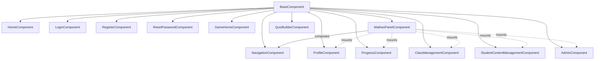

# Frontend UI Components & Main Views

This module documents all screens (views) the user can interact with: home, authentication,
game menu, and the private dashboard (`MatheoPanel`). Unlike the game engine (which runs level logic),
this module handles classic navigation.

Every UI screen is an autonomous component inheriting from a shared base, guaranteeing technical and visual uniformity.

## Fundamental building blocks

### 1. BaseComponent (technical base)

- Folder: `src/components/`
- Abstract founding class dictating mandatory behavior for everything rendered on screen.
- Responsibilities: HTML injection (`render`), scoped CSS isolation (`injectStyle`), mandatory `init()`.

### 2. Public folder (unauthenticated area)

- Folders: `src/components/Public/Home/` and `src/components/Public/Auth/`
- Entry points before login.
- Components:
  - `HomeComponent`: landing/presentation page,
  - `LoginComponent`, `RegisterComponent`, `ResetPasswordComponent`: access forms.
- Technical note: auth components accept success callbacks (e.g. `onLoginSuccess`) in their constructor.
  This lets the router decide when to redirect after a successful action, so the view never handles redirection itself.

### 3. GameHome folder (players hub)

- Folder: `src/components/GameHome/`
- Chapter/level selection menu.
- Displays the world map or available game list; from here the user triggers a route to a specific level
  (which later mounts the game engine).

### 4. MatheoPanel folder (private dashboard)

- Folder: `src/components/MatheoPanel/`
- An app-within-the-app (sub-layout) for the authenticated user's private space (student, teacher, admin).
- Hierarchical structure:
  - `MatheoPanelComponent`: local orchestrator,
  - `NavigationComponent`: side menu, instantiated directly by `MatheoPanelComponent`,
  - dynamic views in `Views/`: `ProfileComponent`, `ProgressComponent`, `ClassManagementComponent`,
    `StudentContentManagementComponent` (+ `QuizBuilderComponent`), `AdminComponent`. These are mounted dynamically
    by the panel depending on the selected tab.

## Dashboard execution flow

1. Route load: the root router mounts `MatheoPanelComponent` in the main content area.
2. Interface build: `MatheoPanelComponent` immediately instantiates its own `NavigationComponent`.
3. Default view: it mounts the default internal view (e.g. `ProfileComponent`) in its internal display area.
4. Internal navigation: on tab click (e.g. "My progression"), `MatheoPanelComponent` destroys the current
   view and mounts the next one (e.g. `ProgressComponent`). The root router is not involved.

## Component map

## Development rules

1. No orphan components: each new view lives in its logical folder and must extend `BaseComponent`.
2. Panel view independence: components under `Views/` must never care about the menu or outer layout; they
   are designed to render at 100% width of the container they receive.
3. Navigation delegation: a view component must not directly instantiate game-engine components; transitions
   (e.g. from `GameHome` to the interactive game) happen through a URL change handled by the router.
