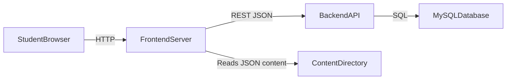

# Architecture

Matheopolis is now split into two servers:

- `backend/`: PHP native API + MySQL persistence.
- `frontend/`: TypeScript vanilla pages + mini-game content files.

## Design principles

- No framework in backend or frontend.
- API contract-first with clear stable routes (`/api/...`).
- Session-based auth (PHP native), hardened with secure cookie settings and idle timeout.
- Content-first frontend: dialogs and mini-games are versioned files under `frontend/content/`.
