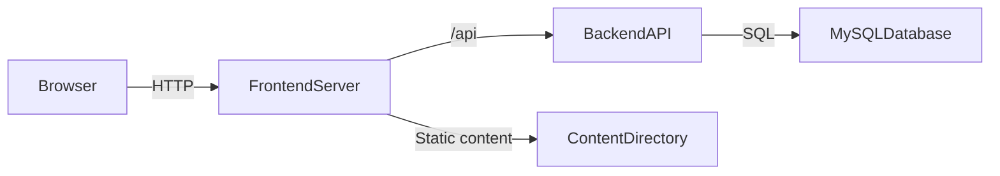

# Architecture

## 1. High-level structure

Matheopolis is a monorepo with a strict two-server model:

- `backend/`: API-only server (PHP native) with MySQL persistence.
- `frontend/`: browser client server (Vanilla TypeScript SPA) for UX, content rendering, and mini-game orchestration.

## 2. Core principles

- No full-stack framework (academic constraint).
- Clean separation between presentation and business logic.
- API contract-first implementation.
- Session-based authentication.
- Security-first defaults (validation, CSRF, access control).
- No legacy code retention after validated refactors.

## 3. Backend architecture

The backend follows a clean layered model:

1. `Domain`: entities and business invariants.
2. `Application`: use cases/services and port interfaces.
3. `Adapter`: HTTP controllers, routing, middleware.
4. `Infrastructure`: concrete persistence/config/security implementations.

Dependency direction:

- Domain has no infrastructure/http dependency.
- Application depends on Domain only.
- Adapter and Infrastructure depend on Application/Domain.

## 4. Frontend architecture

The frontend is a Vanilla TypeScript SPA with:

- `BaseComponent` lifecycle-driven rendering (`init`, `render`, `bindEvents`).
- Hash routing (`#/...`) without full page reload.
- Service layer for business actions.
- A single API client layer for HTTP calls and CSRF/session handling.
- Role-aware route guards and conditional navigation rendering.

## 5. Authentication and authorization

- Backend is the source of truth for identity and authorization.
- Browser uses backend session cookie (`HttpOnly`) and CSRF token headers for mutating requests.
- Role checks exist both:
  - in frontend UX (guarding visibility/navigation), and
  - in backend authorization logic (enforcement).

## 6. Functional model constraints

- Teacher account creation is validated by academic email domain.
- Student belongs to one class maximum.
- Teacher can own multiple classes.
- Riddle progression state is server-owned.
- Anti-cheat flow uses backend-issued play tokens.

## 7. Local development runtime

Development environment is standardized via Docker Compose:

- `matheopolis-frontend`
- `matheopolis-backend`
- `matheopolis-mysql`

All contributors use the same startup scripts and health-checked containers for consistent onboarding and reproducibility.
