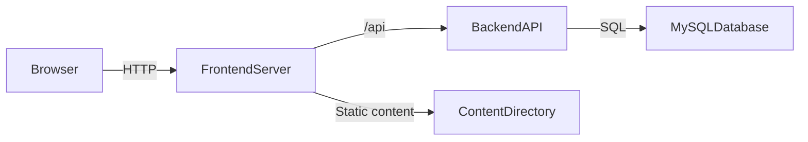

# Architecture

## 1. High-level structure

Matheopolis is a monorepo with a strict two-server model:

- `backend/`: API-only server (PHP native) with MySQL persistence.
- `frontend/`: browser client server (Vanilla TypeScript SPA) for UX, content rendering, and mini-game orchestration.

## 2. Core principles

- No full-stack framework (academic constraint).
- No frontend framework (React, Vue, Angular are forbidden).
- Clean separation between presentation and business logic.
- API contract-first implementation.
- Session-based authentication (PHP session cookie).
- Security-first defaults (validation, CSRF, access control).
- No legacy code retention after validated refactors.

## 3. Backend architecture

The backend follows a clean layered model:

1. `Domain`: entities and business invariants.
2. `Application`: use cases/services and port interfaces.
3. `Adapter`: HTTP controllers, routing, middleware.
4. `Infrastructure`: concrete persistence/config/security implementations.

Dependency direction:

- Domain has no infrastructure/http dependency.
- Application depends on Domain only.
- Adapter and Infrastructure depend on Application/Domain.

## 4. Frontend core and UI foundations

The frontend is a Vanilla TypeScript SPA built around strict orchestration boundaries:

### 4.1 App (entrypoint)

- `App` is instantiated once at startup.
- It composes and owns `HeaderComponent` and `FooterComponent`.
- It initializes the `Router` and declares master routes in `setupRoutes()`.
- It orchestrates only top-level view mounting.

### 4.2 Router (`src/router/`)

- The router listens to hash URL changes.
- It receives a container (for example `<main id="main-content">`) in its constructor.
- Core behavior:
  - register routes (`addRoute()`),
  - force navigation (`navigate()`),
  - clear current container and mount the associated master component (`handleRouting()`).

### 4.3 `BaseComponent` contract (`src/components/`)

All visual components must extend `BaseComponent`.

Mandatory lifecycle contract:

1. `init()`: initialize component logic.
2. `render(htmlTemplate, componentStyle)`: inject markup and apply scoped component class.
3. `injectStyle(css)`: inject isolated CSS.
4. `bindEvents()`: attach DOM event listeners.

### 4.4 Static shell components

- `HeaderComponent` and `FooterComponent` are direct `BaseComponent` children.
- They are persistent shell areas and are never replaced by route changes.

## 5. Frontend main views and UI composition

### 5.1 Public components (`src/components/Public/`)

- Handle unauthenticated entry points (home/auth).
- Auth components receive callbacks (`onLoginSuccess`, etc.) to delegate navigation to router-level logic.

### 5.2 Game home (`src/components/GameHome/`)

- Acts as level and quiz gateway (`GameHomeComponent`).
- Renders three sections in order: chapters, private questionnaires, public questionnaires.
- Title search and type filter chips (chapters / private / public).
- Admin card menus for quiz/chapter actions; navigates to game engine or quiz player routes.

### 5.3 Quiz player (`src/features/QuizPlayer/`)

- `QuizPlayComponent` handles attempt flow and correction display.
- Master routes: `/quiz/:quizId`, `/quiz/:quizId/results`.

### 5.4 MatheoPanel (`src/components/MatheoPanel/`)

- Private dashboard area (student/teacher/admin contexts).
- Uses hierarchical delegation:
  - `MatheoPanelComponent` instantiates `NavigationComponent`,
  - internal panel views (`ProfileComponent`, `ProgressComponent`, `ClassManagementComponent`,
    `QuizManagementComponent`, `StudentContentManagementComponent`, `AdminPanelComponent`) are mounted by the panel itself,
  - the root router is not responsible for these internal swaps.

## 6. Service and API layer architecture

No UI component or game module may call the backend directly.

### 6.1 `ApiClient` monopoly (`src/services/`)

- `ApiClient` is the only layer allowed to perform HTTP requests.
- It centralizes base URL, HTTP methods, credentials handling, CSRF header propagation, and 401/global network behavior.
- Authentication transport is cookie/session based; bearer JWT flows are out of scope for this project.

### 6.2 Core services

- `AuthService`: identity lifecycle (login/logout/me, account creation).
- `UserService`: user profile retrieval/update use cases.
- `ChapterService`: narrative chapter catalog, scenario load, chapter progression.
- `ChapterService`: chapter start, local chapter progression, score submission, and per-challenge attempt tracking.
- `QuizService`: quiz consumer flow (list accessible quizzes, fetch a quiz to play, start an attempt, submit
  per-question answers, fetch the correction). Used by `GameHomeComponent` and `QuizPlayComponent`.

### 6.3 Teacher services (`src/services/teacher/`)

- `TeacherClassService`: class CRUD, student lists, progression views.
- `TeacherQuizService`: database-backed quiz management — create private quizzes, edit questions/options,
  manage per-class access overrides (`listClassAccess`, `setClassAccess`, `removeClassAccess`), request or cancel
  publication (`askAdmin`), delete owned quizzes.
- `StudentContentAccessService`: teacher UI facade for per-class content access; quizzes wired to target-classes API;
  chapters will use chapter target-class API with the same grant/restrict semantics.

### 6.4 Admin services (`src/services/admin/`)

- `AdminManagementService`: global administration operations.
- `AdminQuizService`: quiz administration — list publication requests (`askAdmin = true`), publish/unpublish,
  dismiss requests, edit/delete any quiz. No stored rejection reason; declining leaves the quiz private.

## 7. Game engine architecture

The game engine is an autonomous execution system driven by state transitions and step iteration.

### 7.1 `GameContainerComponent` (`src/features/GameEngine/`)

- Instantiated by the router as a master view.
- Loads chapter scenario from the API and coordinates chapter/riddle progression calls.
- Instantiates the engine core, listens to `stepComplete`, mounts/unmounts blocks dynamically, and submits end-of-run results.

### 7.2 `SequenceManager` (`src/features/GameEngine/core/`)

- Encapsulates scenario iteration over `GameStep[]`.
- Public progression method: `advanceToNextStep(): bool`.

### 7.3 Game registry

- Chapter scenarios are loaded from `/api/chapters/{id}` through `ChapterService`.
- `GamesRegistry` maps game identifiers to concrete TypeScript classes.
- New games must be registered, not hardcoded via branching in orchestrators.

### 7.4 Blocks and mini-games

- Blocks in `blocks/` are `BaseComponent` implementations (`DialogueBlockComponent`, `InfoBlockComponent`,
  `RiddleBlockComponent`). `TutorialBlockComponent` was removed; training uses `RiddleStep` with `mode: "practice"`.
- `RiddleBlockComponent` is the game-hosting shell: mode banner, instruction panel, shared action bar
  (`Indice` / `Valider` / `Suivant`), and mini-game host.
- Shared helpers: `blocks/shared/stepInteractionChrome.ts`, `games/shared/QuestionSequence.ts`.
- Mini-games in `games/` must extend `BaseGame` and implement:
  - `start()`,
  - `destroy()` (mandatory cleanup),
  - `showHint()`.
- Challenge steps validate answers through `/api/riddles/{id}/responses`; practice steps validate locally when
  the API exposes practice answers. Completion always waits for `Suivant`.

## 8. Authentication and authorization

- Backend is the source of truth for identity and authorization.
- Browser uses backend session cookie (`HttpOnly`) and CSRF token headers for mutating requests.
- No JWT bearer authentication is used in the current architecture.
- Role checks exist both:
  - in frontend UX (guarding visibility/navigation), and
  - in backend authorization logic (enforcement).

## 9. Typical execution flows

### 9.1 Application startup

`new App().init()` -> create header/footer -> create router -> register master routes -> mount requested route.

### 9.2 Dashboard internal navigation (MatheoPanel)

Router mounts `MatheoPanelComponent` -> panel mounts `NavigationComponent` -> panel mounts default internal view.
On tab change: panel unmounts current internal view and mounts next internal view. Root router does not participate.

### 9.3 Game engine loop

Router mounts `GameContainerComponent` -> container resolves config from registries -> starts backend session via service -> creates `SequenceManager`.
Loop:

1. read current step,
2. mount block (dialog/info/riddle),
3. wait for completion event,
4. unmount block and advance sequence,
5. submit final progression/score and redirect on completion.

## 10. Functional model constraints

- Generic account creation assigns teacher accounts for academic email domains and free-user accounts otherwise.
- Student account creation requires a class code and uses a server-generated username.
- Student belongs to one class maximum.
- Teacher can own multiple classes.
- Chapter and riddle progression are server-owned for all authenticated accounts (`user_id` in DB).
- Guests use `GET /api/chapters` without persisting progression.
- Public chapter and riddle play endpoints for guests; progression requires authentication.

## 11. Golden rules (strict)

1. Zero frontend framework: Vanilla TypeScript and direct DOM only.
2. Strict inheritance:
   - all visual components extend `BaseComponent`,
   - all mini-games extend `BaseGame`.
3. `ApiClient` monopoly:
   - no `fetch` in components or game classes,
   - services call `ApiClient`,
   - avoid `any` in service return contracts.
4. Scoped styling:
   - component CSS is injected through component rendering flow,
   - no large global stylesheet as default architecture.
5. Delegation and isolation:
   - router mounts master views only,
   - child views/blocks are mounted by their parent containers.
6. Open/closed game engine:
   - no `if/else` branching to handle new game types in orchestrators,
   - rely on registries for extension.
7. Mandatory teardown:
   - complex components and mini-games must release event listeners/resources in `destroy()`.

## 12. Local development runtime

Development environment is standardized via Docker Compose:

- `matheopolis-frontend`
- `matheopolis-backend`
- `matheopolis-mysql`

All contributors use the same startup scripts and health-checked containers for consistent onboarding and reproducibility.

## 13. Frontend target structure note

The frontend architecture is defined by a target modular layout (see `docs/frontend-technical-spec.md`), including:

- dedicated `models/`, `services/`, and `components/` domains,
- role-specific services under `services/teacher` and `services/admin`,
- a structured game engine under `features/GameEngine` with registries, blocks, and game implementations,
- colocated templates/styles per component where relevant.

The current frontend implementation follows this target structure and keeps the visual language sourced from the Figma export under `/maquette`, without retaining the old draft frontend code.
