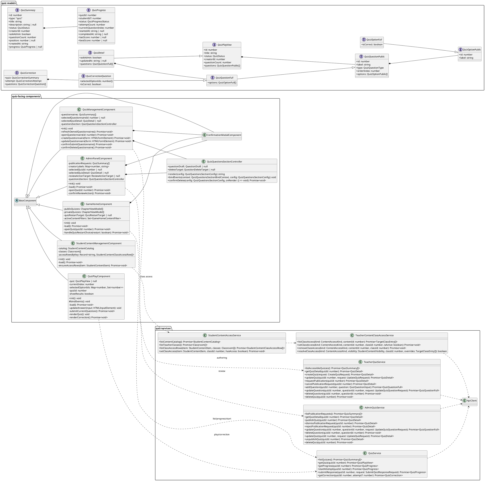

# Frontend Class Diagrams

These diagrams describe the current frontend TypeScript structure only. They avoid backend classes and keep
relationships focused on ownership, inheritance, routing, service flow, and game/quiz orchestration.

## Global Package Diagram

This diagram gives a package-level view of the SPA. `App` creates the service container and the router,
the router mounts `BaseComponent` views, services use `ApiClient`, and the game engine stays isolated behind
its container, blocks, registries, and `BaseGame` contract.

```plantuml
@startuml
hide members
skinparam packageStyle rectangle
skinparam classAttributeIconSize 0

package "Core and Routing" {
  class App
  class Router
  interface RouteParams
  interface RouteDefinition
  interface RouteMatch
  class RouteFactory <<type>>
}

package "Services" {
  interface AppServices
  class AppServicesFactory <<factory>>
  class ApiClient
  class AuthService
  class UserService
  class ChapterService
  class ContentService
  class GameAccessService
  class ProgressMetricsService
  class QuizService

  package "teacher" {
    class TeacherClassService
    class TeacherQuizService
    class TeacherContentClassAccessService
    class StudentContentAccessService
  }

  package "admin" {
    class AdminManagementService
    class AdminQuizService
  }
}

package "Components and Views" {
  abstract class BaseComponent
  class HeaderComponent
  class FooterModule <<module>>
  class HomeComponent
  class AboutComponent
  class LoginComponent
  class RegisterComponent
  class ResetPasswordComponent
  class VerifyEmailComponent
  class StudentIntroComponent
  class GameHomeComponent
  class QuizPlayComponent
  class NotFoundComponent
  class ConfirmationModalComponent

  package "MatheoPanel" {
    class MatheoPanelComponent
    class NavigationComponent
    class ProfileComponent
    class ProgressComponent
    class StudentClassComponent
    class ClassManagementComponent
    class QuizManagementComponent
    class StudentContentManagementComponent
    class AdminPanelComponent
    class QuizQuestionsSectionController
  }
}

package "Game Engine" {
  class GameContainerComponent
  class SequenceManager
  class DialogueBlockComponent
  class InfoBlockComponent
  class RiddleBlockComponent
  class StepInteractionChrome <<module>>
  class GamesRegistry <<module>>
  class ConfigsRegistry <<module>>
  abstract class BaseGame
  class PianoFractionsGame
  class BaseConversionGame
  class HexConversionGame
  class FractalLuthierGame
  class QuestionSequence
}

package "Models and Types" {
  class GameStep <<union>>
  interface DialogueStep
  interface RiddleStep
  interface RiddleQuestion
  interface InfoStep
  interface DialogueLine
  interface QuizSummary
  interface QuizPlayView
  interface QuizDetail
  interface QuizProgress
  interface User
  interface Chapter
  interface Classroom
  interface BaseGameContext
  class BaseGameParams <<type>>
}

App *-- AppServices : creates
App *-- Router : creates
App *-- HeaderComponent : owns
App ..> HomeComponent : route
App ..> LoginComponent : route
App ..> RegisterComponent : route
App ..> ResetPasswordComponent : route
App ..> VerifyEmailComponent : route
App ..> AboutComponent : route
App ..> StudentIntroComponent : route
App ..> GameHomeComponent : route
App ..> MatheoPanelComponent : route
App ..> QuizPlayComponent : route
App ..> GameContainerComponent : route
App ..> NotFoundComponent : fallback

Router ..> BaseComponent : mounts
Router ..> AuthService : guards
Router ..> RouteDefinition
Router ..> RouteMatch
RouteMatch *-- RouteParams

AppServicesFactory ..> AppServices : builds
AppServices *-- ApiClient
AppServices *-- AuthService
AppServices *-- UserService
AppServices *-- ChapterService
AppServices *-- ContentService
AppServices *-- GameAccessService
AppServices *-- ProgressMetricsService
AppServices *-- QuizService
AppServices *-- TeacherClassService
AppServices *-- TeacherQuizService
AppServices *-- TeacherContentClassAccessService
AppServices *-- StudentContentAccessService
AppServices *-- AdminManagementService
AppServices *-- AdminQuizService

AuthService ..> ApiClient
UserService ..> ApiClient
ChapterService ..> ApiClient
QuizService ..> ApiClient
TeacherClassService ..> ApiClient
TeacherQuizService ..> ApiClient
TeacherContentClassAccessService ..> ApiClient
AdminQuizService ..> ApiClient
StudentContentAccessService ..> TeacherContentClassAccessService

BaseComponent <|-- HeaderComponent
BaseComponent <|-- HomeComponent
BaseComponent <|-- AboutComponent
BaseComponent <|-- LoginComponent
BaseComponent <|-- RegisterComponent
BaseComponent <|-- ResetPasswordComponent
BaseComponent <|-- VerifyEmailComponent
BaseComponent <|-- StudentIntroComponent
BaseComponent <|-- GameHomeComponent
BaseComponent <|-- QuizPlayComponent
BaseComponent <|-- NotFoundComponent
BaseComponent <|-- ConfirmationModalComponent
BaseComponent <|-- MatheoPanelComponent
BaseComponent <|-- NavigationComponent
BaseComponent <|-- ProfileComponent
BaseComponent <|-- ProgressComponent
BaseComponent <|-- StudentClassComponent
BaseComponent <|-- ClassManagementComponent
BaseComponent <|-- QuizManagementComponent
BaseComponent <|-- StudentContentManagementComponent
BaseComponent <|-- AdminPanelComponent

MatheoPanelComponent *-- NavigationComponent
MatheoPanelComponent ..> ProfileComponent : mounts
MatheoPanelComponent ..> ProgressComponent : mounts
MatheoPanelComponent ..> StudentClassComponent : mounts
MatheoPanelComponent ..> ClassManagementComponent : mounts
MatheoPanelComponent ..> QuizManagementComponent : mounts
MatheoPanelComponent ..> StudentContentManagementComponent : mounts
MatheoPanelComponent ..> AdminPanelComponent : mounts
QuizManagementComponent *-- QuizQuestionsSectionController
AdminPanelComponent *-- QuizQuestionsSectionController
GameHomeComponent *-- ConfirmationModalComponent
AboutComponent ..> FooterModule

BaseComponent <|-- GameContainerComponent
BaseComponent <|-- DialogueBlockComponent
BaseComponent <|-- InfoBlockComponent
BaseComponent <|-- RiddleBlockComponent
GameContainerComponent *-- SequenceManager
GameContainerComponent ..> DialogueBlockComponent : mounts
GameContainerComponent ..> InfoBlockComponent : mounts
GameContainerComponent ..> RiddleBlockComponent : mounts
GameContainerComponent ..> ChapterService
RiddleBlockComponent *-- BaseGame : owns
RiddleBlockComponent ..> GamesRegistry
RiddleBlockComponent ..> StepInteractionChrome
BaseGame <|-- PianoFractionsGame
BaseGame <|-- BaseConversionGame
BaseGame <|-- HexConversionGame
BaseGame <|-- FractalLuthierGame
BaseConversionGame *-- QuestionSequence
HexConversionGame *-- QuestionSequence
GamesRegistry ..> PianoFractionsGame
GamesRegistry ..> BaseConversionGame
GamesRegistry ..> HexConversionGame
GamesRegistry ..> FractalLuthierGame
ConfigsRegistry ..> GameStep : local seeds

SequenceManager o-- GameStep
GameStep ..> DialogueStep
GameStep ..> RiddleStep
GameStep ..> InfoStep
DialogueStep *-- DialogueLine
RiddleStep *-- RiddleQuestion
QuizDetail --|> QuizPlayView
@enduml
```

## Main Application Diagram

This diagram focuses on the entrypoint and routing contract. The current shell owns a hidden
`HeaderComponent`; the old `FooterComponent` class no longer exists and is represented by the `FooterModule`
template/style helpers used by public pages such as `AboutComponent`.

```plantuml
@startuml
skinparam classAttributeIconSize 0

package "src" {
  class App {
    - services: AppServices
    - router: Router | null
    - header: HeaderComponent | null
    + App()
    + init(): void
    - setupRoutes(router: Router): void
    - bindEvents(): void
    - injectResponsiveShellStyles(): void
    - mainContainer(): HTMLElement
  }
}

package "router" {
  class Router {
    - routes: RouteDefinition[]
    - container: HTMLElement
    - currentComponent: BaseComponent | null
    - notFoundFactory: RouteFactory | null
    - services: AppServices
    + Router(containerId: string, services: AppServices)
    + addRoute(pattern: string, factory: RouteFactory, options?: RouteOptions): void
    + setNotFound(factory: RouteFactory): void
    + navigate(path: string): void
    + clearTokenFromUrl(): void
    + start(): void
    + handleRouting(): Promise<void>
    - bootstrapPathFromLocation(): void
    - canEnter(definition: RouteDefinition): Promise<boolean>
    - mount(component: BaseComponent): void
    - mountNotFound(path: string): Promise<void>
    - findMatch(path: string): RouteMatch | null
    - matchPattern(pattern: string, path: string): RouteParams | null
    - parts(path: string): string[]
    - normalize(path: string): string
  }

  interface RouteParams {
    + [key: string]: string
  }

  class RouteFactory <<type>> {
    + (params: RouteParams): BaseComponent | Promise<BaseComponent>
  }

  interface RouteDefinition {
    + pattern: string
    + factory: RouteFactory
    + protectedRoute: boolean
    + allowGuest: boolean
    + roles: UserRole[] | null
  }

  interface RouteMatch {
    + definition: RouteDefinition
    + params: RouteParams
  }
}

package "components" {
  abstract class BaseComponent {
    # container: HTMLElement
    # componentId: string
    # root: HTMLElement | null
    - styleElement: HTMLStyleElement | null
    - disposers: Array<() => void>
    + BaseComponent(container: HTMLElement, componentId: string)
    + {abstract} init(): void
    + destroy(): void
    # render(htmlTemplate: string, componentStyle?: string): void
    # updateRegion(selector: string, htmlTemplate: string): void
    # {abstract} bindEvents(): void
    # query<TElement extends HTMLElement>(selector: string): TElement | null
    # queryAll<TElement extends HTMLElement>(selector: string): TElement[]
    # listen<K extends keyof HTMLElementEventMap>(target: HTMLElement | Window | Document, type: K, listener: (event: HTMLElementEventMap[K]) => void): void
    # listenTo(target: EventTarget, type: string, listener: (event: Event) => void): void
    # emit<TDetail>(name: string, detail?: TDetail): void
    # clearListeners(): void
    - injectStyle(cssContent: string): void
  }

  class HeaderComponent {
    - services: AppServices
    + HeaderComponent(container: HTMLElement, services: AppServices)
    + init(): void
    + refresh(): void
    # bindEvents(): void
  }

  class FooterModule <<module>> {
    + footerTemplate(): string
    + footerStyles(hostSelector?: string): string
  }
}

package "services" {
  interface AppServices
  class AppServicesFactory <<factory>> {
    + createAppServices(): AppServices
  }
}

package "route components" {
  class HomeComponent
  class AboutComponent
  class LoginComponent
  class RegisterComponent
  class ResetPasswordComponent
  class VerifyEmailComponent
  class StudentIntroComponent
  class GameHomeComponent
  class MatheoPanelComponent
  class QuizPlayComponent
  class GameContainerComponent
  class NotFoundComponent
}

BaseComponent <|-- HeaderComponent
App *-- AppServices : creates
App *-- Router : owns
App *-- HeaderComponent : owns
App ..> AppServicesFactory : calls
Router ..> BaseComponent : mounts/destroys
Router ..> RouteDefinition
RouteDefinition --> RouteFactory
RouteMatch *-- RouteParams

App ..> HomeComponent
App ..> AboutComponent
App ..> LoginComponent
App ..> RegisterComponent
App ..> ResetPasswordComponent
App ..> VerifyEmailComponent
App ..> StudentIntroComponent
App ..> GameHomeComponent
App ..> MatheoPanelComponent
App ..> QuizPlayComponent
App ..> GameContainerComponent
App ..> NotFoundComponent
AboutComponent ..> FooterModule
@enduml
```

## Components Diagram

This diagram shows the frontend visual classes outside the game engine. All rendered views inherit from
`BaseComponent`; large views such as `GameHomeComponent`, `MatheoPanelComponent`, `ClassManagementComponent`,
`QuizManagementComponent`, and `AdminPanelComponent` act as local orchestrators that mount child components
and react to typed custom events.

```plantuml
@startuml
left to right direction
skinparam classAttributeIconSize 0

package "components" {
  abstract class BaseComponent {
    # container: HTMLElement
    # componentId: string
    # root: HTMLElement | null
    - styleElement: HTMLStyleElement | null
    - disposers: Array<() => void>
    + {abstract} init(): void
    + destroy(): void
    # render(htmlTemplate: string, componentStyle?: string): void
    # updateRegion(selector: string, htmlTemplate: string): void
    # {abstract} bindEvents(): void
    # query<TElement extends HTMLElement>(selector: string): TElement | null
    # queryAll<TElement extends HTMLElement>(selector: string): TElement[]
    # listen<K extends keyof HTMLElementEventMap>(target: HTMLElement | Window | Document, type: K, listener: (event: HTMLElementEventMap[K]) => void): void
    # listenTo(target: EventTarget, type: string, listener: (event: Event) => void): void
    # emit<TDetail>(name: string, detail?: TDetail): void
    # clearListeners(): void
    - injectStyle(cssContent: string): void
  }

  package "Layout" {
    class HeaderComponent {
      - services: AppServices
      + HeaderComponent(container: HTMLElement, services: AppServices)
      + init(): void
      + refresh(): void
      # bindEvents(): void
    }

    class FooterModule <<module>> {
      + footerTemplate(): string
      + footerStyles(hostSelector?: string): string
    }
  }

  package "Shared" {
    class ConfirmationModalComponent {
      - config: ConfirmationModalConfig
      + ConfirmationModalComponent(container: HTMLElement, config: ConfirmationModalConfig)
      + init(): void
      # bindEvents(): void
      - emitAction(action: ConfirmationModalActionType): void
    }

    class BackToMapButtonModule <<module>>
    class FloatingTopButtonModule <<module>>
    class NotFoundComponent
  }

  package "Public" {
    class HomeComponent {
      - router: Router
      - services: AppServices
      + init(): void
      # bindEvents(): void
    }

    class AboutComponent {
      - router: Router
      + init(): void
      # bindEvents(): void
    }

    class LoginComponent {
      - router: Router
      - services: AppServices
      + init(): void
      # bindEvents(): void
      - submit(form: HTMLFormElement): Promise<void>
    }

    class RegisterComponent {
      - activeMode: RegisterMode
      - router: Router
      - services: AppServices
      + init(): void
      # bindEvents(): void
      - updateModeFields(): void
      - submit(form: HTMLFormElement): Promise<void>
      - readFormState(form: HTMLFormElement): RegisterFormState
      - updateAcademicHint(): void
      - isAcademicEmail(email: string): boolean
    }

    class ResetPasswordComponent {
      - resetToken: string | null
      - router: Router
      - services: AppServices
      + init(): void
      # bindEvents(): void
      - bindFormEvents(hasToken: boolean): void
      - submit(form: HTMLFormElement, hasToken: boolean): Promise<void>
    }

    class VerifyEmailComponent {
      - router: Router
      - services: AppServices
      - token: string | null
      + init(): void
      # bindEvents(): void
      - verify(): Promise<void>
    }

    class StudentIntroComponent {
      - index: number
      - router: Router
      + init(): void
      # bindEvents(): void
      - renderIntro(): void
    }
  }

  package "GameHome and QuizPlayer" {
    class GameHomeComponent {
      - publicQuizzes: ChapterViewModel[]
      - privateQuizzes: ChapterViewModel[]
      - chapters: ChapterViewModel[]
      - playerName: string
      - isGuestMode: boolean
      - quizRestartTarget: QuizRestartTarget | null
      - chapterRestartTarget: ChapterRestartTarget | null
      - activeContentFilters: Set<GameHomeContentFilter>
      - confirmationModals: ConfirmationModalComponent[]
      + init(): void
      + destroy(): void
      # bindEvents(): void
      - load(): Promise<void>
      - openQuiz(quizId: number): Promise<void>
      - openChapter(chapterId: number): Promise<void>
      - renderContentArea(): void
      - renderModalsArea(): void
    }

    class QuizPlayComponent {
      - quiz: QuizPlayView | null
      - currentIndex: number
      - selectedOptionIds: Map<number, Set<number>>
      - router: Router
      - services: AppServices
      - quizId: number
      - showResults: boolean
      + init(): void
      # bindEvents(): void
      - load(): Promise<void>
      - updateAnswer(input: HTMLInputElement): void
      - submitCurrentQuestion(): Promise<void>
      - renderQuiz(): void
      - renderCorrection(): Promise<void>
    }
  }

  package "MatheoPanel" {
    class MatheoPanelComponent {
      - navigation: NavigationComponent | null
      - activeView: BaseComponent | null
      - user: User | null
      - currentView: PanelViewId
      - router: Router
      - services: AppServices
      + init(): void
      + destroy(): void
      # bindEvents(): void
      - load(): Promise<void>
      - mountView(viewId: PanelViewId): void
      - defaultViewForRole(role: UserRole): PanelViewId
    }

    class NavigationComponent {
      - activeView: PanelViewId
      - isMenuOpen: boolean
      - role: UserRole
      + init(): void
      + setActive(viewId: PanelViewId): void
      # bindEvents(): void
      - renderNav(): void
      - closeMenu(shouldRender?: boolean): void
    }

    class ProfileComponent {
      - services: AppServices
      + init(): void
      # bindEvents(): void
      - load(): Promise<void>
      - profileCards(user: User, metrics: ProgressMetricsWithTotal): string[]
    }

    class ProgressComponent {
      - services: AppServices
      - options?: ProgressComponentOptions
      + init(): void
      # bindEvents(): void
      - load(): Promise<void>
      - loadPersonalView(): Promise<void>
      - loadStudentView(context: StudentProgressViewContext): Promise<void>
    }

    class StudentClassComponent {
      + init(): void
      # bindEvents(): void
    }

    class ClassManagementComponent {
      - classes: Classroom[]
      - selectedClassId: number | null
      - progressRows: StudentChapterProgressSummary[]
      - studentProgressView: ProgressComponent | null
      - childComponents: BaseComponent[]
      - confirmationModals: ConfirmationModalComponent[]
      - services: AppServices
      + init(): void
      + destroy(): void
      # bindEvents(): void
      - load(): Promise<void>
      - renderView(): void
      - selectClass(classId: number): Promise<void>
      - createClass(values: ClassFormValues): Promise<void>
      - submitStudentsImport(file: File | null): Promise<void>
      - exportClassProgress(mode?: ProgressExportMode, chapterId?: number, quizId?: number): Promise<void>
      - mountStudentProgressView(): void
    }

    class ClassManagementHeaderComponent
    class ClassListComponent
    class ClassDetailComponent
    class ClassFormModalComponent
    class StudentsImportModalComponent
    class ProgressExportModalComponent

    class QuizManagementComponent {
      - questionnaires: QuizSummary[]
      - selectedQuestionnaireId: number | null
      - selectedQuizDetail: QuizDetail | null
      - questionsSection: QuizQuestionsSectionController
      - confirmationModals: ConfirmationModalComponent[]
      - services: AppServices
      + init(): void
      + destroy(): void
      # bindEvents(): void
      - load(): Promise<void>
      - refreshOwnedQuestionnaires(): Promise<void>
      - openQuestionnaire(id: number): Promise<void>
      - createQuestionnaire(form: HTMLFormElement): Promise<void>
      - updateQuestionnaire(form: HTMLFormElement): Promise<void>
      - confirmSubmitQuestionnaire(): Promise<void>
      - confirmDeleteQuestionnaire(): Promise<void>
      - renderView(): void
    }

    class StudentContentManagementComponent {
      - catalog: StudentContentCatalog
      - classes: Classroom[]
      - openMenuKey: string | null
      - loadingMenuKey: string | null
      - accessRowsByKey: Record<string, StudentContentClassAccessRow[]>
      - services: AppServices
      + init(): void
      # bindEvents(): void
      - load(): Promise<void>
      - ensureAccessRows(item: StudentContentItem): Promise<void>
      - renderView(): void
      - getClassAccessByContentKey(): Record<string, Record<number, boolean>>
    }

    class AdminPanelComponent {
      - publicationRequests: QuizSummary[]
      - creatorLabels: Map<number, string>
      - selectedQuizId: number | null
      - selectedQuizDetail: QuizDetail | null
      - reviewActionTarget: ReviewActionTarget | null
      - questionsSection: QuizQuestionsSectionController
      - confirmationModals: ConfirmationModalComponent[]
      - services: AppServices
      + init(): void
      + destroy(): void
      # bindEvents(): void
      - load(): Promise<void>
      - openQuiz(id: number): Promise<void>
      - confirmReviewAction(): Promise<void>
      - renderView(): void
    }

    class QuizQuestionsSectionController {
      + questionDraft: QuestionDraft | null
      + questionDraftMessage: string
      + openMenuQuestionId: number | null
      + deleteTarget: QuestionDeleteTarget | null
      + isSavingQuestion: boolean
      + isDeletingQuestion: boolean
      + reset(): void
      + render(config: QuizQuestionsSectionConfig): string
      + getDeleteConfirmationConfig(): ConfirmationModalConfig | null
      + bindEvents(context: QuizQuestionsSectionBindContext, config: QuizQuestionsSectionConfig): void
      + confirmDelete(config: QuizQuestionsSectionConfig, onRender: () => void): Promise<void>
      + closeDeleteModal(onRender: () => void): void
    }
  }
}

BaseComponent <|-- HeaderComponent
BaseComponent <|-- ConfirmationModalComponent
BaseComponent <|-- NotFoundComponent
BaseComponent <|-- HomeComponent
BaseComponent <|-- AboutComponent
BaseComponent <|-- LoginComponent
BaseComponent <|-- RegisterComponent
BaseComponent <|-- ResetPasswordComponent
BaseComponent <|-- VerifyEmailComponent
BaseComponent <|-- StudentIntroComponent
BaseComponent <|-- GameHomeComponent
BaseComponent <|-- QuizPlayComponent
BaseComponent <|-- MatheoPanelComponent
BaseComponent <|-- NavigationComponent
BaseComponent <|-- ProfileComponent
BaseComponent <|-- ProgressComponent
BaseComponent <|-- StudentClassComponent
BaseComponent <|-- ClassManagementComponent
BaseComponent <|-- ClassManagementHeaderComponent
BaseComponent <|-- ClassListComponent
BaseComponent <|-- ClassDetailComponent
BaseComponent <|-- ClassFormModalComponent
BaseComponent <|-- StudentsImportModalComponent
BaseComponent <|-- ProgressExportModalComponent
BaseComponent <|-- QuizManagementComponent
BaseComponent <|-- StudentContentManagementComponent
BaseComponent <|-- AdminPanelComponent

AboutComponent ..> FooterModule
AboutComponent ..> BackToMapButtonModule
GameHomeComponent *-- ConfirmationModalComponent
GameHomeComponent ..> FloatingTopButtonModule
QuizPlayComponent ..> FloatingTopButtonModule
MatheoPanelComponent *-- NavigationComponent
MatheoPanelComponent ..> ProfileComponent : mounts
MatheoPanelComponent ..> ProgressComponent : mounts
MatheoPanelComponent ..> StudentClassComponent : mounts
MatheoPanelComponent ..> ClassManagementComponent : mounts
MatheoPanelComponent ..> QuizManagementComponent : mounts
MatheoPanelComponent ..> StudentContentManagementComponent : mounts
MatheoPanelComponent ..> AdminPanelComponent : mounts
ClassManagementComponent *-- ClassManagementHeaderComponent
ClassManagementComponent *-- ClassListComponent
ClassManagementComponent *-- ClassDetailComponent
ClassManagementComponent *-- ClassFormModalComponent
ClassManagementComponent *-- StudentsImportModalComponent
ClassManagementComponent *-- ProgressExportModalComponent
ClassManagementComponent *-- ConfirmationModalComponent
ClassManagementComponent *-- ProgressComponent
QuizManagementComponent *-- QuizQuestionsSectionController
QuizManagementComponent *-- ConfirmationModalComponent
AdminPanelComponent *-- QuizQuestionsSectionController
AdminPanelComponent *-- ConfirmationModalComponent
@enduml
```

## Services Diagram

This diagram shows the frontend service flow toward the backend API. `ApiClient` is the single HTTP funnel;
domain services unwrap typed envelopes, compose local state where needed, and expose methods consumed by
components or the game engine.

```plantuml
@startuml
left to right direction
skinparam classAttributeIconSize 0

package "services" {
  class ApiClient {
    - baseUrl: string
    - mockMode: boolean
    - csrfToken: string | null
    + ApiClient()
    + get<TData>(endpoint: string, queryParams?: Record<string, QueryValue>): Promise<ApiEnvelope<TData>>
    + post<TData>(endpoint: string, body?: object): Promise<ApiEnvelope<TData>>
    + patch<TData>(endpoint: string, body: object): Promise<ApiEnvelope<TData>>
    + put<TData>(endpoint: string, body: object): Promise<ApiEnvelope<TData>>
    + delete<TData>(endpoint: string): Promise<ApiEnvelope<TData>>
    + postCsvDownload(endpoint: string, csvContent: string): Promise<CsvDownload>
    + getCsvDownload(endpoint: string, queryParams?: Record<string, QueryValue>): Promise<CsvDownload>
    + isMockMode(): boolean
    - request<TData>(endpoint: string, options: RequestOptions, queryParams?: Record<string, QueryValue>): Promise<ApiEnvelope<TData>>
    - buildUrl(endpoint: string, queryParams?: Record<string, QueryValue>): string
    - buildHeaders(options: RequestOptions): HeadersInit
    - buildCsvHeaders(): HeadersInit
    - readJson(response: Response): Promise<unknown>
    - captureCsrfToken(data: unknown): void
    - mockRequest<TData>(endpoint: string, options: RequestOptions): Promise<ApiEnvelope<TData>>
  }

  class AuthService {
    - currentUser: User | null
    - api: ApiClient
    + login(request: LoginRequest): Promise<User>
    + logout(): Promise<void>
    + getMe(): Promise<User | null>
    + registerTeacher(request: CreateTeacherRequest): Promise<RegisterAccountResult>
    + registerStudent(request: CreateStudentRequest): Promise<User>
    + registerAccount(request: CreateAccountRequest): Promise<RegisterAccountResult>
    + requestPasswordReset(email: string): Promise<string>
    + resetPassword(token: string, password: string): Promise<string>
    + verifyEmail(token: string): Promise<string>
    + startGuestSession(): User
    + endGuestSession(): void
    + isGuestUser(user: User): boolean
    + isLocalOnlyUser(user: User): boolean
    - completeRegistration(user: User, email: string, password: string): Promise<RegisterAccountResult>
    - setCurrentUser(user: User | null): void
    - readLocalUser(): User | null
  }

  class UserService {
    - api: ApiClient
    - auth: AuthService
    + getCurrentProfile(): Promise<User | null>
    + getUserProfile(userId: number): Promise<User>
  }

  class ChapterService {
    - api: ApiClient
    - auth: AuthService
    + listChapters(): Promise<Chapter[]>
    + getChapter(chapterId: number): Promise<ChapterDetail>
    + startChapter(chapterId: number): Promise<ChapterStartEnvelopeData>
    + getProgress(chapterId: number): Promise<ChapterProgress>
    + completeChapter(chapterId: number, score?: number, playToken?: string): Promise<ChapterProgress>
    + submitScore(chapterId: number, score: number, playToken?: string): Promise<ChapterProgress>
    + syncChapterStep(chapterId: number, currentStepIndex: number): Promise<ChapterProgress>
    + startRiddle(riddleId: number): Promise<RiddleProgress>
    + submitRiddleResponse(riddleId: number, request: RiddleResponseRequest): Promise<RiddleResponseResultEnvelopeData>
  }

  class ContentService {
    - api: ApiClient
  }

  class GameAccessService {
    - storageKey: string
    + list(): GameAccessState
    + isEnabled(chapterId: number): boolean
    + setEnabled(chapterId: number, enabled: boolean): void
    + toggle(chapterId: number): boolean
  }

  class ProgressMetricsService {
    + loadFromChapters(chapters: ChapterService): Promise<ProgressMetricsWithTotal>
    + fromChapterProgress(progressItems: Array<ChapterProgress | ProgressItem>, totalChapters?: number): ProgressMetricsWithTotal
    + fromProgress(progressItems: Array<ChapterProgress | ProgressItem>): ProgressMetrics
    + progressPercent(progress: ChapterProgress, stepCount?: number | null): number
    + fromPercentages(percentages: number[]): ProgressMetrics
  }

  class QuizService {
    - api: ApiClient
    + listQuizzes(): Promise<QuizSummary[]>
    + getQuiz(quizId: number): Promise<QuizPlayView>
    + getProgress(quizId: number): Promise<QuizProgress>
    + startAttempt(quizId: number): Promise<QuizProgress>
    + submitResponse(quizId: number, request: SubmitQuizResponseRequest): Promise<QuizProgress>
    + getCorrection(quizId: number, attempt?: number): Promise<QuizCorrection>
    - normalizeProgress(progress: ApiQuizProgress): QuizProgress
  }

  package "teacher" {
    class TeacherClassService {
      - cacheKey: string
      - api: ApiClient
      + listCachedClasses(): Classroom[]
      + listMyClasses(): Promise<Classroom[]>
      + createClass(request: CreateClassRequest): Promise<Classroom>
      + getClassDetails(classId: number): Promise<ClassroomDetail>
      + updateClass(classId: number, request: UpdateClassRequest): Promise<Classroom>
      + deleteClass(classId: number): Promise<void>
      + listStudents(classId: number): Promise<User[]>
      + listStudentsProgress(classId: number): Promise<StudentChapterProgressSummary[]>
      + importStudentsCsv(classId: number, csvContent: string): Promise<CsvDownload>
      + listChaptersForExport(): Promise<Chapter[]>
      + exportStudentsProgressCsv(classId: number, mode?: ProgressExportMode, chapterId?: number, quizId?: number): Promise<CsvDownload>
      + deleteStudentAccount(classId: number, studentId: number): Promise<void>
      + resetStudentPassword(classId: number, studentId: number): Promise<string>
    }

    class TeacherQuizService {
      - api: ApiClient
      - gameAccess: GameAccessService
      + listAccessibleQuizzes(): Promise<QuizSummary[]>
      + getQuizDetail(quizId: number): Promise<QuizDetail>
      + createQuiz(request: CreateQuizRequest): Promise<QuizDetail>
      + updateQuiz(quizId: number, request: UpdateQuizRequest): Promise<QuizDetail>
      + requestPublication(quizId: number): Promise<QuizDetail>
      + cancelPublicationRequest(quizId: number): Promise<QuizDetail>
      + addQuestion(quizId: number, question: QuizQuestionInput): Promise<QuizQuestionFull>
      + deleteQuiz(quizId: number): Promise<void>
      + updateQuestion(quizId: number, questionId: number, request: UpdateQuizQuestionRequest): Promise<QuizQuestionFull>
      + deleteQuestion(quizId: number, questionId: number): Promise<void>
      + setGameEnabled(chapterId: number, enabled: boolean): void
    }

    class TeacherContentClassAccessService {
      - cache: Map<string, TargetClassEntry[]>
      - api: ApiClient
      + listClassAccess(kind: ContentAccessKind, contentId: number): Promise<TargetClassEntry[]>
      + setClassAccess(kind: ContentAccessKind, contentId: number, classId: number, isActive: boolean): Promise<void>
      + removeClassAccess(kind: ContentAccessKind, contentId: number, classId: number): Promise<void>
      + resolveClassAccess(kind: ContentAccessKind, visibility: StudentContentVisibility, classId: number, overrides: TargetClassEntry[]): boolean
      + invalidateCache(kind: ContentAccessKind, contentId: number): void
      - targetClassesEndpoint(kind: ContentAccessKind, contentId: number): string
      - defaultAccess(kind: ContentAccessKind, visibility: StudentContentVisibility): boolean
      - cacheKey(kind: ContentAccessKind, contentId: number): string
    }

    class StudentContentAccessService {
      - teacherClasses: TeacherClassService
      - teacherQuizzes: TeacherQuizService
      - chapters: ChapterService
      - contentClassAccess: TeacherContentClassAccessService
      + listContentCatalog(): Promise<StudentContentCatalog>
      + listContentItems(): Promise<StudentContentItem[]>
      + listTeacherClasses(): Promise<Classroom[]>
      + listClassAccessRows(item: StudentContentItem, classes: Classroom[]): Promise<StudentContentClassAccessRow[]>
      + isClassAccessEnabled(item: StudentContentItem, classId: number, cachedRows?: StudentContentClassAccessRow[]): boolean
      + setClassAccess(item: StudentContentItem, classId: number, hasAccess: boolean): Promise<void>
      - mapQuizItems(quizzes: QuizSummary[], visibility: "public" | "private"): StudentContentItem[]
      - loadChaptersFromApi(): Promise<StudentContentItem[]>
    }
  }

  package "admin" {
    class AdminManagementService {
      + getTeachers(): Promise<User[]>
    }

    class AdminQuizService {
      - api: ApiClient
      + listPublicationRequests(): Promise<QuizSummary[]>
      + getQuizDetail(quizId: number): Promise<QuizDetail>
      + publishQuiz(quizId: number): Promise<QuizDetail>
      + dismissPublicationRequest(quizId: number): Promise<QuizDetail>
      + rejectPublicationRequest(quizId: number): Promise<QuizDetail>
      + updateQuestion(quizId: number, questionId: number, request: UpdateQuizQuestionRequest): Promise<QuizQuestionFull>
      + deleteQuestion(quizId: number, questionId: number): Promise<void>
      + updateQuiz(quizId: number, request: UpdateQuizRequest): Promise<QuizDetail>
      + unpublishQuiz(quizId: number): Promise<QuizDetail>
      + deleteQuiz(quizId: number): Promise<void>
    }
  }

  interface AppServices {
    + api: ApiClient
    + auth: AuthService
    + users: UserService
    + chapters: ChapterService
    + content: ContentService
    + gameAccess: GameAccessService
    + progressMetrics: ProgressMetricsService
    + quizzes: QuizService
    + teacherClasses: TeacherClassService
    + contentClassAccess: TeacherContentClassAccessService
    + teacherQuizzes: TeacherQuizService
    + studentContentAccess: StudentContentAccessService
    + adminManagement: AdminManagementService
    + adminQuizzes: AdminQuizService
  }

  class AppServicesFactory <<factory>> {
    + createAppServices(): AppServices
  }
}

AppServicesFactory ..> AppServices
AppServices *-- ApiClient
AppServices *-- AuthService
AppServices *-- UserService
AppServices *-- ChapterService
AppServices *-- ContentService
AppServices *-- GameAccessService
AppServices *-- ProgressMetricsService
AppServices *-- QuizService
AppServices *-- TeacherClassService
AppServices *-- TeacherQuizService
AppServices *-- TeacherContentClassAccessService
AppServices *-- StudentContentAccessService
AppServices *-- AdminManagementService
AppServices *-- AdminQuizService

AuthService ..> ApiClient
UserService ..> ApiClient
UserService ..> AuthService
ChapterService ..> ApiClient
ChapterService ..> AuthService
ContentService ..> ApiClient
QuizService ..> ApiClient
TeacherClassService ..> ApiClient
TeacherQuizService ..> ApiClient
TeacherQuizService ..> GameAccessService
TeacherContentClassAccessService ..> ApiClient
StudentContentAccessService ..> TeacherClassService
StudentContentAccessService ..> TeacherQuizService
StudentContentAccessService ..> ChapterService
StudentContentAccessService ..> TeacherContentClassAccessService
AdminQuizService ..> ApiClient
@enduml
```

## Game Engine Diagram

This diagram represents the current level engine. `GameContainerComponent` loads the API-hydrated scenario,
drives `SequenceManager`, mounts blocks, and uses `ChapterService` for persistence. `RiddleBlockComponent`
owns one `BaseGame` instance and handles the shared riddle shell; concrete mini-games only implement game rules.

```plantuml
@startuml
left to right direction
skinparam classAttributeIconSize 0

package "external frontend contracts" {
  abstract class BaseComponent {
    # container: HTMLElement
    # componentId: string
    # root: HTMLElement | null
    - styleElement: HTMLStyleElement | null
    - disposers: Array<() => void>
    + {abstract} init(): void
    + destroy(): void
    # render(htmlTemplate: string, componentStyle?: string): void
    # updateRegion(selector: string, htmlTemplate: string): void
    # {abstract} bindEvents(): void
    # query<TElement extends HTMLElement>(selector: string): TElement | null
    # queryAll<TElement extends HTMLElement>(selector: string): TElement[]
    # listen<K extends keyof HTMLElementEventMap>(target: HTMLElement | Window | Document, type: K, listener: (event: HTMLElementEventMap[K]) => void): void
    # listenTo(target: EventTarget, type: string, listener: (event: Event) => void): void
    # emit<TDetail>(name: string, detail?: TDetail): void
    # clearListeners(): void
  }

  class Router
  class ChapterService
  class ContentService
}

package "GameEngine" {
  class GameContainerComponent {
    - {static} currentQuestionDifficulty: number
    - brain: SequenceManager | null
    - currentBlock: BaseComponent | null
    - scenarioSteps: GameStep[]
    - playToken: string
    - riddleScores: number[]
    - ending: boolean
    - viewingTemporaryInfo: boolean
    - temporaryInfoStep: InfoStep | null
    - isLocalOnlyRun: boolean
    - router: Router
    - services: AppServices
    - chapterId: number
    + GameContainerComponent(container: HTMLElement, router: Router, services: AppServices, chapterId: number)
    + init(): void
    + destroy(): void
    # bindEvents(): void
    - start(): Promise<void>
    - normalizeScenario(scenario: GameStep[]): GameStep[]
    - filterScenarioQuestions(scenario: GameStep[]): GameStep[]
    - advance(detail?: StepCompleteDetail): Promise<void>
    - loadCurrentStep(): void
    - mountBlock(step: GameStep): Promise<void>
    - syncCurrentStep(): Promise<void>
    - validateRiddleAnswer(step: RiddleStep, request: RiddleAnswerValidationRequest): Promise<RiddleAnswerValidationResult>
    - endGame(): Promise<void>
    - computeChapterScore(): number
    - showTemporaryInfoStep(step: InfoStep): void
  }

  package "core" {
    class SequenceManager {
      - steps: GameStep[]
      - currentIndex: number
      + SequenceManager(steps: GameStep[], initialIndex?: number)
      + getCurrentStep(): GameStep | null
      + getCurrentIndex(): number
      + advanceToNextStep(): boolean
      - hasNextStep(): boolean
      - normalizeInitialIndex(index: number): number
    }
  }

  package "blocks" {
    class DialogueBlockComponent {
      - index: number
      - history: DialogueLine[]
      - isTyping: boolean
      - typingTimeout?: number
      - currentText: string
      - step: DialogueStep
      + DialogueBlockComponent(container: HTMLElement, step: DialogueStep)
      + init(): void
      # bindEvents(): void
      - next(): void
      - previous(): void
      - renderDialogue(): void
      - startTypewriter(element: HTMLParagraphElement): void
      - completeTyping(): void
      - renderStageStyle(): string
    }

    class InfoBlockComponent {
      - step: InfoStep
      + InfoBlockComponent(container: HTMLElement, step: InfoStep)
      + init(): void
      # bindEvents(): void
      - renderScopedStyles(): string
      - renderContentStyle(): string
    }

    class RiddleBlockComponent {
      - game: BaseGame | null
      - score: number
      - mistakes: number
      - activeQuestionIndex: number
      - visibleHintQuestionIndex: number | null
      - step: RiddleStep
      - context: BaseGameContext
      - canReturnToCourse: boolean
      + RiddleBlockComponent(container: HTMLElement, step: RiddleStep, context: BaseGameContext, canReturnToCourse?: boolean)
      - isPractice: boolean
      + init(): void
      + destroy(): void
      # bindEvents(): void
      - updateProgress(score: number, mistakes: number, currentQuestionIndex?: number): void
      - taskPrompt(): string
      - updateCurrentQuestion(): void
      - showShellHint(): void
      - syncHintPanel(): void
    }

    class StepInteractionChrome <<module>> {
      + renderStepInteractionChrome(): string
      + stepInteractionChromeStyles(): string
      + bindStepInteractionChrome(query: StepQuery, listen: StepListen, handlers: StepInteractionHandlers): void
      + showStepCompletion(query: StepQuery, message: string): void
      + setStepValidateVisible(query: StepQuery, visible: boolean, enabled?: boolean): void
    }
  }

  package "games" {
    class GamesRegistry <<module>> {
      - gamesRegistry: Record<string, GameConstructor>
      + getGameConstructor(gameId: string): GameConstructor | null
    }

    abstract class BaseGame {
      - disposers: Array<() => void>
      - pendingWin: GameWonDetail | null
      # completed: boolean
      # container: HTMLElement
      # params: BaseGameParams
      # context: BaseGameContext
      + BaseGame(container: HTMLElement, params: BaseGameParams, context: BaseGameContext)
      + {abstract} start(): void
      + destroy(): void
      + {abstract} showHint(): void
      + submitAnswer(): void | Promise<void>
      + proceedToNextStep(): void
      # isPracticeMode(): boolean
      # clearListeners(): void
      # listen<K extends keyof HTMLElementEventMap>(target: HTMLElement, type: K, listener: (event: HTMLElementEventMap[K]) => void): void
      # complete(score: number, answer: string): void
      # updateProgress(score: number, mistakes: number, currentQuestionIndex?: number): void
      # markCompleted(score: number, answer: string): void
      # markCompletedWithMistakes(completedUnits: number, mistakes: number, answer: string): void
      # notifyValidate(visible: boolean, enabled?: boolean): void
    }

    class PianoFractionsGame {
      - notes: NoteItem[]
      - melodyQuestions: RiddleQuestion[]
      - validationQuestion: RiddleQuestion | undefined
      - selectedNotes: NoteItem[]
      - mistakes: number
      - confirmedCount: number
      - audioContext: AudioContext | null
      + start(): void
      + destroy(): void
      + showHint(): void
      + submitAnswer(): Promise<void>
      - renderGame(activeNote?: string): void
      - validateMelody(): Promise<AnswerValidationResult>
      - syncProgress(): void
    }

    class BaseConversionGame {
      - sequence: QuestionSequence
      - feedbackMessage: string
      - feedbackTone: "good" | "bad" | "info"
      - solvedAnswers: string[]
      + start(): void
      + submitAnswer(): Promise<void>
      + showHint(): void
      - renderSecretDate(): string
      - renderChallenge(): void
      - renderProgressFooter(): string
    }

    class HexConversionGame {
      - sequence: QuestionSequence
      - feedbackMessage: string
      - feedbackTone: "good" | "bad" | "info"
      - solvedAnswers: string[]
      + start(): void
      + submitAnswer(): Promise<void>
      + showHint(): void
      - renderSecretCode(): string
      - renderChallenge(): void
      - renderProgressFooter(): string
    }

    class FractalLuthierGame {
      - levels: FractalLevel[]
      - currentLevelIndex: number
      - currentDepth: number
      - currentAngle: number
      - mistakes: number
      - audioContext: AudioContext | null
      - animationId: number | null
      - animationStack: BranchTask[]
      - isPlaying: boolean
      - isTargetMode: boolean
      + start(): void
      + destroy(): void
      + showHint(): void
      + submitAnswer(): void
      - renderGame(): void
      - startAnimatedTree(depth: number, angle: number, targetMode: boolean): void
      - checkWinCondition(): Promise<void>
      - syncProgress(): void
      - readLevels(): FractalLevel[]
    }

    class QuestionSequence {
      - index: number
      - mistakes: number
      - options: QuestionSequenceOptions
      + QuestionSequence(options: QuestionSequenceOptions)
      + currentIndex: number
      + currentMistakes: number
      + totalCount: number
      + completionAnswerId: string
      + currentQuestion: RiddleQuestion | undefined
      + isComplete: boolean
      + isEmpty: boolean
      + reset(): void
      + syncProgress(): void
      + recordCorrect(): SequenceTurnResult
      + recordMistake(): void
    }
  }

  package "configs" {
    class ConfigsRegistry <<module>> {
      + listConfiguredChapters(): Chapter[]
      + getScenario(chapterId: number): GameStep[] | null
    }
  }
}

package "models" {
  class GameStep <<union>>
  interface DialogueLine {
    + speakerId: string
    + text: string
    + emotion?: DialogueEmotion
    + image?: string
    + position?: "left" | "right"
  }
  interface DialogueStep {
    + type: "dialogue"
    + backgroundImg?: string
    + lines: DialogueLine[]
  }
  interface RiddleStep {
    + type: "riddle"
    + riddleId?: number
    + gameId: string
    + mode?: RiddleMode
    + title: string
    + introText?: string
    + instruction: string
    + completionMessage: string
    + questions: RiddleQuestion[]
    + gameParams?: Record<string, unknown>
  }
  interface RiddleQuestion {
    + id?: number
    + question: string
    + answer?: string
    + hint?: string
    + difficulty: number
    + metadata?: Record<string, unknown>
  }
  interface InfoStep {
    + type: "info"
    + title?: string
    + text?: string
    + content?: InfoContentDocument | InfoContentNode[]
    + contentCss?: string
    + secondaryAction?: InfoSecondaryAction
    + buttonText?: string
    + theme?: "default" | "endChapter" | "startChapter" | "sign"
  }
  interface BaseGameContext {
    + content: ContentService
    + validateAnswer(request: RiddleAnswerValidationRequest): Promise<RiddleAnswerValidationResult>
  }
  class BaseGameParams <<type>> {
    + questions: RiddleQuestion[]
    + completionMessage?: string
    + instruction?: string
    + mode?: RiddleMode
    + title?: string
  }
}

BaseComponent <|-- GameContainerComponent
BaseComponent <|-- DialogueBlockComponent
BaseComponent <|-- InfoBlockComponent
BaseComponent <|-- RiddleBlockComponent

GameContainerComponent *-- SequenceManager
GameContainerComponent o-- BaseComponent : currentBlock
GameContainerComponent ..> DialogueBlockComponent : mounts
GameContainerComponent ..> InfoBlockComponent : mounts
GameContainerComponent ..> RiddleBlockComponent : mounts
GameContainerComponent ..> Router
GameContainerComponent ..> ChapterService : start/sync/score
GameContainerComponent ..> ContentService : passes context

SequenceManager o-- GameStep : iterates
RiddleBlockComponent *-- BaseGame : owns current game
RiddleBlockComponent ..> GamesRegistry : getGameConstructor()
RiddleBlockComponent ..> StepInteractionChrome : uses
RiddleBlockComponent ..> BaseGameContext
InfoBlockComponent ..> InfoStep
DialogueBlockComponent ..> DialogueStep

BaseGame <|-- PianoFractionsGame
BaseGame <|-- BaseConversionGame
BaseGame <|-- HexConversionGame
BaseGame <|-- FractalLuthierGame
BaseConversionGame *-- QuestionSequence
HexConversionGame *-- QuestionSequence
GamesRegistry ..> PianoFractionsGame
GamesRegistry ..> BaseConversionGame
GamesRegistry ..> HexConversionGame
GamesRegistry ..> FractalLuthierGame
ConfigsRegistry ..> GameStep : local mock/seed data

GameStep ..> DialogueStep
GameStep ..> RiddleStep
GameStep ..> InfoStep
DialogueStep *-- DialogueLine
RiddleStep *-- RiddleQuestion
BaseGameParams *-- RiddleQuestion
BaseGameContext ..> ContentService
@enduml
```

## Quiz Diagram

This diagram isolates questionnaires. `GameHomeComponent` opens quiz routes, `QuizPlayComponent` handles
attempts and corrections, teachers/admins edit quiz content through shared question-section logic, and
class access for public/private quizzes is handled through the student-content facade.

