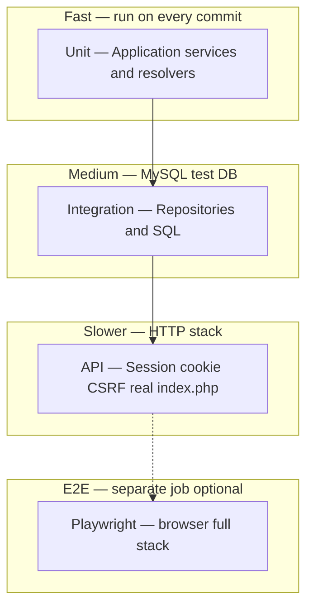
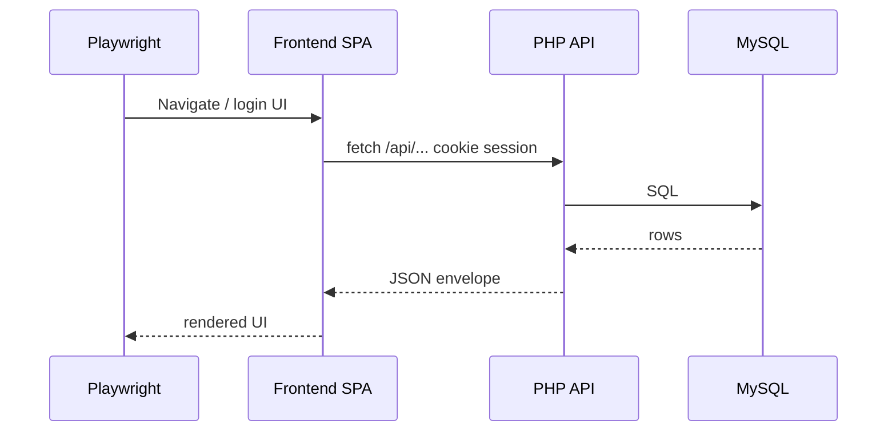

# Backend test plan — Matheopolis

This document is the implementation roadmap for automated backend testing. It consolidates
team decisions from planning (backend-first, MySQL in CI, high coverage target, chapters/riddles API)
and maps **business needs** to **test levels**.

Human-readable API rules live in [`../api/`](../api/). Machine-readable shapes live in
[`../openapi.yaml`](../openapi.yaml).

## 1. Goals

| Goal | How tests support it |
| --- | --- |
| Safe refactors (quiz, chapters, riddles, classes) | Fast unit + integration feedback |
| Role and visibility correctness | Unit resolvers + API matrix per role |
| Progression integrity | Integration repos + API state transitions |
| Contract stability | API tests assert envelope + key fields vs OpenAPI |
| ~70% backend coverage | PHPUnit coverage on `src/` (see §6) |

**Out of scope for this plan (other owner):** frontend unit tests (Vitest), UI component tests.
**Related but separate:** browser E2E (Playwright) — full stack, documented in §4.

## 2. Test pyramid (backend)



| Level | Tool | Runs against | Typical runtime |
| --- | --- | --- | --- |
| Unit | PHPUnit | Mocks (ports), no DB | ms per test |
| Integration | PHPUnit + PDO | MySQL `matheopolis_test` | seconds |
| API / HTTP | PHPUnit + HTTP client | `public/index.php` + test DB | seconds |
| E2E | Playwright (TypeScript) | Docker: frontend + backend + MySQL | minutes |

### What each level must prove

**Unit** — business rules in isolation:

- `QuizAccessResolver`, `ChapterAccessResolver`
- `ApiQuizService` (scoring, attempt rules, visibility)
- `ApiChapterService` / `ApiRiddleService` (practice vs challenge, auto-complete chapter)
- `ScenarioBuilder` (play payload shape, no answers in questions)
- `ApiAuthService` (rate limit policy if extracted)
- Answer normalization (`answersMatch` logic)

**Integration** — SQL and repositories:

- CRUD and constraints (FK, unique keys)
- `ChapterRepository`, `RiddleRepository`, `ScenarioRepository`
- `ChapterProgressRepository`, `RiddleProgressRepository` (transitions, responses)
- `QuizRepository`, `QuizProgressRepository`
- Seed fixtures: minimal factory SQL per test class, not full `seed.sql` unless scenario needs it

**API** — vertical slices through HTTP:

- Envelope: `{ success, data, error }`
- Session: login → cookie → `X-CSRF-Token` on POST/PATCH/PUT/DELETE
- Public reads: `GET /api/chapters`, `GET /api/chapters/{id}`, `GET /api/riddles/{id}` without session
- Authenticated progression: all roles `student`, `free_user`, `teacher`, `admin` read **own** progress
- Errors: `401`, `404`, `409`, `422` codes from [`../api.md`](../api.md)

**E2E (Playwright)** — not PHPUnit; see §4.

## 3. Business coverage matrix (backend)

Priority **P0** = first implementation waves. **P1** = expand toward 70% coverage.

### Authentication and users

| Need | Level | P |
| --- | --- | --- |
| Login with username/password | API | P0 |
| Invalid credentials → `401` | API | P0 |
| `GET /api/auth/me` + CSRF token | API | P0 |
| Logout invalidates session | API | P1 |
| Registration validation (`422`) | API | P1 |

### Classes (teacher)

| Need | Level | P |
| --- | --- | --- |
| Teacher creates/owns class | Integration + API | P1 |
| Student list scoped to class | API | P1 |
| Progress export CSV columns | Unit (formatter) + API | P1 |

### Quizzes

| Need | Level | P |
| --- | --- | --- |
| List filtered by role (student vs teacher vs admin) | Unit + API | P0 |
| Public vs private + `quiz_target_classes` restrict/grant | Unit + API | P0 |
| Start attempt, submit responses, complete | Integration + API | P0 |
| Scoring and correction payload | Unit + API | P0 |
| Teacher CRUD questions | API | P1 |

### Chapters (narrative)

| Need | Level | P |
| --- | --- | --- |
| Public list/show (guest + authenticated) | API | P0 |
| Student class restriction (`chapter_target_classes`) | Unit + API | P0 |
| Hydrated `scenario.steps` (info, riddle; dialogue when seeded) | Integration + API | P0 |
| Start / progress / complete chapter | Integration + API | P0 |
| Complete blocked until challenge riddles done | API | P0 |

### Riddles

| Need | Level | P |
| --- | --- | --- |
| Public `GET /api/riddles/{id}` when chapter accessible | API | P0 |
| Practice: no `start`, no `responses` (`422`) | API | P0 |
| Challenge: start → responses by `questionId` / `questionIndex` | Integration + API | P0 |
| Wrong answer keeps `currentQuestionIndex` | Integration + API | P0 |
| Correct answer advances; last question → `completed` | Integration + API | P0 |
| Auto-complete parent chapter when all challenges done | API | P0 |
| Own progress for `free_user`, `student`, `teacher`, `admin` | API | P0 |

### Cross-cutting

| Need | Level | P |
| --- | --- | --- |
| CSRF rejected without token on mutation | API | P0 |
| `404` masks forbidden chapter/riddle (student restricted) | API | P0 |
| Schema/seed scripts contain core tables | Integration (existing) | done |

## 4. Playwright (E2E) — what it is and how it fits

**Playwright** is a browser automation framework (Microsoft). Tests drive a real browser (Chromium,
Firefox, or WebKit) programmatically:

- open URLs, click buttons, fill forms;
- assert on visible text, DOM, or network responses;
- run in headless mode in CI.

It is **not** a PHP tool. In this monorepo it usually lives as TypeScript tests under `e2e/` or
`frontend/e2e/`, executed with `npx playwright test`.

### Full-stack E2E (your decision: no mocks)



Recommended CI stack:

1. `docker compose` (or GitHub Actions services): MySQL + backend + frontend static/server.
2. Apply `schema.sql` + minimal test seed (or dedicated `e2e-seed.sql`).
3. Playwright `baseURL` = frontend origin; API on same host or configured proxy.

**Division of labour:** backend owner implements PHPUnit pyramid; Playwright can be introduced in
parallel by frontend owner using the same Docker stack. Backend plan does not block on Playwright.

### Pilot Playwright scenarios (P1, ~3 flows)

1. Guest: open GameHome → open chapter → see first riddle step (no login).
2. Student `sam.student1`: login → start challenge riddle → submit correct answer → progress persists after reload.
3. Teacher: login → open class progression view (if exposed in UI).

## 5. How to write **clean** tests

### Principles

1. **Arrange – Act – Assert** in every test; one logical behavior per test.
2. **Deterministic data**: use known users from test seed (`sam.student1` / `password`), not random emails.
3. **Isolation**: each test creates the state it needs; use transactions rolled back or `TRUNCATE` order
   respecting FKs between tests.
4. **Naming**: `testStudentCannotSeeRestrictedChapterInList` not `testChapter2`.
5. **No logic in tests**: avoid loops/assertions built from production code; duplicate expected values from spec.
6. **Ports mocked only in unit tests**; integration/API use real repositories and MySQL.

### PHPUnit layout (target)

```
backend/tests/
  Unit/           # fast, mocks
  Integration/    # repositories + MySQL
  Api/            # HTTP end-to-end (rename from misleading Functional/)
  Support/        # TestCase, HttpClient, DatabaseFixture, AuthHelper
```

Rename note: current `tests/Functional/RouteMatchingTest.php` tests the `Route` value object only —
keep as `Unit/Router/RouteMatchingTest.php` or add real API tests under `tests/Api/`.

### Shared test infrastructure

| Component | Responsibility |
| --- | --- |
| `TestDatabase` | Create DB, apply `schema.sql`, optional minimal seed, truncate helpers |
| `ApiTestCase` | `loginAs('sam.student1')`, `get/post` with cookie jar + CSRF header |
| `FixtureBuilder` | Insert chapter/riddle/quiz rows for edge cases not in seed |

Environment variables (`TEST_*` in repository root `.env`):

- `TEST_DB_NAME=matheopolis_test`
- Same host/user as CI MySQL service

## 6. Coverage target (~70%)

- Measure with `composer test:coverage` (clover → CI artifact already exists).
- **Scope:** all of `backend/src/` unless we exclude pure DTO/config (document exclusions in `phpunit.xml`).
- **Realistic path:** reach ~40–50% after P0 API + integration; ~70% after P1 matrix.
- Enforce gradually: CI warning at 50%, fail at 70% once stable (avoid flapping).

High-yield files for coverage: `Application/Service/*`, `Infrastructure/Persistence/Repository/*`.
Low priority: `Adapter/Http/Middleware` (thin), `Domain` entities (mostly getters).

## 7. CI changes (backend)

| Job | Change |
| --- | --- |
| `backend-tests` | Add MySQL 8 service; `matheopolis_test`; run migrations/schema before PHPUnit |
| `backend-coverage` | Optional: fail if coverage &lt; threshold (when ready) |
| New `e2e` (optional) | Playwright against compose stack — separate workflow or nightly |

Example GitHub Actions service (conceptual):

```yaml
services:
  mysql:
    image: mysql:8.4
    env:
      MYSQL_ROOT_PASSWORD: root
      MYSQL_DATABASE: matheopolis_test
```

## 8. Implementation phases

### Phase 0 — Foundation (immediate)

- [x] Register **Unit** + **Api** suites in `phpunit.xml` (70% line gate on coverage run).
- [x] Add `tests/Support/` (database + API client + fixtures).
- [x] Document `TEST_*` in root `.env` and local `composer test` with Docker MySQL.
- [x] Update [`testing.md`](../testing.md) with pyramid link.
- [x] `APP_ENV=test` disables login rate limit (`NullRateLimiter`).
- [x] CI: MySQL service + PHP built-in server for Api tests.

### Phase 1 — P0 unit + integration (quizzes + access)

- [x] `ChapterAccessResolverTest` (mirror quiz tests)
- [x] Extend `QuizAccessResolverTest` edge cases
- [x] `QuizProgressRepositoryTest`, `ChapterProgressRepositoryTest`, `RiddleProgressRepositoryTest` (MySQL)
- [x] `ScenarioRepositoryTest` (hydration for piano chapter)
- [x] `QuizRepositoryTest`, `ChapterRepositoryTest`, `RiddleRepositoryTest`

### Phase 2 — P0 API HTTP

- [x] Auth helper + CSRF on mutations (`CsrfApiTest`)
- [x] Chapters: public list/show, restriction, progression, auto-complete
- [x] Riddles: public show, challenge flow, practice rejected
- [x] Quizzes: student list + attempt + correction + teacher create

### Phase 3 — P1 breadth + coverage push

- [x] Users/classes/auth registration paths (API + unit)
- [x] Class CSV export + students progress API
- [x] Quiz target-classes grant (teacher)
- [x] Quiz teacher PATCH / question management + admin publication
- [ ] Coverage report review; close gaps to ~70% (`composer test:coverage:check`)

### Phase 4 — Playwright (coordination)

- [ ] Init Playwright in repo (`e2e/` recommended at monorepo root)
- [ ] `docker-compose.e2e.yml` or profile `e2e`
- [ ] Three pilot scenarios (§4)
- [ ] CI job (allow failure initially)

## 9. Decisions (validated)

| Topic | Decision |
| --- | --- |
| HTTP usage | **No HTTP** in unit/integration; **real HTTP** in Api suite and Playwright E2E |
| Test data | **Per-test inserts** only; `seed.sql` is for manual use |
| Coverage CI | **70% lines** minimum (`phpunit.xml` + `composer test:coverage`) |
| Playwright path | **`e2e/`** at monorepo root (frontend team) |
| Rate limit | **`NullRateLimiter`** when `APP_ENV=test` |

---

## 10. Implementation status

| Item | Status |
| --- | --- |
| `phpunit.xml` Unit + Api suites | Done |
| `tests/bootstrap.php` + root `.env` (`TEST_*`) | Done |
| `TestDatabase`, fixtures, Integration/Api support | Done |
| Sample Unit / Integration / Api tests | Expanded (P0 matrix); coverage still below 70% — add P1 tests |
| `composer test:coverage:check` | Enforces 70% via `scripts/check-coverage.php` |
| MySQL + API server in CI | Done |
| Playwright `e2e/` | Planned (frontend) |

---

## 10. References

- [PHPUnit](https://phpunit.de/)
- [Playwright](https://playwright.dev/)
- [testing.md](../testing.md) — commands and demo accounts
- [api.md](../api.md) — error codes and CSRF rules
